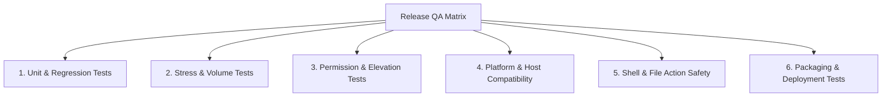

# ArborGraph Release QA Technical & Functional Audit Report

**Audit Target:** ArborGraph Desktop Application (WPF / .NET 8.0 Windows x64) & Official Portal  
**Repository:** `12valor/ArborGraph` (Local: `c:\Users\evang\Downloads\diskscope`)  
**Assembly / Product:** `ArborGraph.exe` (v1.0.0, `net8.0-windows`, x64)  
**Verification Method:** Static Code Analysis, Source Architecture Tracing, and Automated Test Harness Execution  
**Current Git Commit:** `ee25485`  

---

## 1. Executive Summary & Application Architecture

ArborGraph (formerly DiskScope / DiskScope Pro) is an offline desktop storage analytics, visualization, and maintenance suite built with WPF (.NET 8) and an embedded SQLite database in Write-Ahead Logging (WAL) mode (`scan_index.db`).

### Architectural Overview
- **UI Architecture:** Windows Presentation Foundation (WPF) with MVVM pattern (`ObservableObject`, `RelayCommand`), custom styling dictionaries (`Resources/Colors.xaml`, `Resources/Styles.xaml`), custom `FrameworkElement` sparkline graph rendering (`RealtimeMetricGraph.cs`), and tab-level asynchronous loading guards.
- **Scanner Subsystem:** Decoupled Breadth-First Search (BFS) filesystem traversal streaming discovered items into a `System.Threading.Channels.Channel<FileRecord>` with bounded capacity (20,000 items) and a dedicated background SQLite ingestion worker writing in batches of 5,000 records.
- **Fast Incremental Scanner:** Direct P/Invoke to Win32 `kernel32.dll` (`DeviceIoControl` with `FSCTL_READ_USN_JOURNAL`) querying the NTFS USN Change Journal, synchronizing SQLite against volume-level file alterations since last checkpoint.
- **Data Analytics & Rollup:** Mathematically exact post-scan directory rollup (`BuildDirectoryRollup`) aggregating directory hierarchies and file counts; 5-tier temporal file age breakdown; and historical scan session delta comparisons.
- **Deduplication Engine:** 3-stage cryptographic detection pipeline: (1) SQLite size collision grouping, (2) 8KB head/tail partial MD5 hashing, (3) full SHA-256 validation.
- **Maintenance & Cleanup:** Contextual developer storage detection (Node.js, .NET, Rust, Gradle, Python, Containers), locked-file safe deletion fallback, Adobe Photoshop scratch/cache reclaimer, and safe Recycle Bin integration with system directory protection.
- **Installer & Portal:** Inno Setup 6 64-bit installer (`installer/installer.iss`) and web portal diagnostic simulator (`site/index.html`, `site/app.js`).

---

## 2. Specific Audit Identifications

### 1. Features with No Obvious Automated Tests
- **Application Startup Shutdown Flow:** In `App.xaml.cs`, the code that terminates the process via `Shutdown(0)` if the user cancels or closes the EULA dialog on first run is not exercised in CI tests (only the dialog class itself is tested).
- **Native Shell Actions:** `FileActionService.OpenFile`, `OpenFileLocation`, and `ShowProperties` (`ShellExecuteEx`) have no unit or integration tests because executing them would launch active Windows Explorer windows and default media players on the test runner.
- **Clipboard Retry Loop:** `FileActionService.CopyPath` COM exception retry logic (5 attempts with 50ms sleep) is not covered by tests.
- **Recycle Bin Shell Operation:** `FileActionService.MoveToRecycleBin` (using `Microsoft.VisualBasic.FileIO` and `SHFileOperation`) is not exercised in `tests/Program.cs`. Test 8 tests `JunkCleanerService`, which uses direct `File.Delete`.
- **Inno Setup Installer Execution:** `installer/installer.iss` has no automated installation/uninstallation test verifying clean registry/directory states.
- **Web Portal Client Logic:** `site/app.js` has no automated browser test suite (Playwright/Puppeteer).
- **Interactive Treemap Canvas Navigation:** Breadcrumb click navigation and node selection edge cases in `TreemapViewModel` are only tested via layout geometry, not user event dispatch.

### 2. High-Risk Features
- **Permanent File Deletion (`DeletePermanently`):** Directly calls `Directory.Delete(path, recursive: true)` and unlinks files. Any logic error in path resolution or exclusion filtering poses catastrophic data loss risk.
- **Batch Cleanup Operations:** `CleanupCenterViewModel.CleanSelectedAsync(useRecycleBin: false)` and `DeveloperStorageViewModel.CleanSelectedEcosystemSafeAsync` perform bulk deletions across multi-gigabyte folder trees.
- **USN Journal P/Invoke (`UsnJournalService`):** Low-level Win32 `DeviceIoControl` memory pointer manipulation. Memory buffer overrun or invalid handle marshaling could crash the process.
- **Multi-Drive Scoped Clearing (`ClearIndex`):** When scanning drive roots (e.g., `D:\`), `ClearIndex` treats any root of length <= 2 ending in `:` as a full index wipe, deleting previously indexed records from other drives.

### 3. Functions That Could Crash the Application
- **`UsnJournalService.ReadChanges`:** (Line 233 in `UsnJournalService.cs`). Unmanaged pointer arithmetic (`Marshal.PtrToStructure`, `Marshal.ReadInt32`). If the kernel writes past the allocated unmanaged buffer, an unmanaged Access Violation will crash the CLR without catchable managed exception.
- **`FileActionService.ShowProperties`:** Native call to `shell32.dll` via `ShellExecuteEx`. If a buggy 3rd-party shell extension is registered on the host Windows machine for the target file extension, Shell32 will crash within the process space.
- **`TreemapLayoutEngine.WorstAspectRatio`:** In `TreemapLayoutEngine.cs`, if `side` is 0 or NaN, floating-point division produces `Infinity` or `NaN`. Passing NaN coordinates into WPF layout triggers `ArgumentException` inside `System.Windows.UIElement.Measure`.

### 4. Functions That Could Cause Data Loss
- **`FileActionService.DeletePermanently`:** (In `FileActionService.cs`). Recursively purges directories from disk without Recycle Bin recovery.
- **`DeveloperStorageViewModel.CleanSelectedEcosystemSafeAsync`:** (In `DeveloperStorageViewModel.cs`). Deletes target directories. If contextual validation misidentifies an actual project directory named `target` or `build` as temporary junk, code could be permanently lost.
- **`JunkCleanerViewModel.CleanSelectedAsync`:** (In `JunkCleanerViewModel.cs`). Bulk deletion of system temp folders. If a user or third-party app placed unsaved working documents in `%TEMP%`, those files are destroyed.
- **`DatabaseService.ClearIndex`:** (In `DatabaseService.cs`). Clears SQLite index metadata, forcing the user to rescan drives to recover insights.

### 5. Functions That Could Cause Excessive CPU/RAM Usage
- **`DatabaseService.BuildDirectoryRollup`:** (In `DatabaseService.cs`). Loads all distinct directory paths into memory, builds a tree of `FolderRollupNode` objects for every path and ancestor, and performs recursive sorting. On a drive with 2,000,000 files in 300,000 directories, this allocates 300,000+ objects in the Large Object Heap (LOH), spiking RAM into gigabytes and triggering GC gen-2 freezes.
- **`DuplicateAnalyzer.FindDuplicatesAsync`:** (In `DuplicateAnalyzer.cs`). Stage 3 executes full SHA-256 over entire files. If candidates are 10GB+ video files, disk throughput and CPU hashing saturate for extended periods.
- **`ScannerService.ScanDrivesAsync` (`visitedPaths`):** (`ScannerService.cs`). Maintains an unbounded `HashSet<string>(StringComparer.OrdinalIgnoreCase)` of every visited directory path to prevent symlink loops. On enterprise drives with 500,000+ directories, this hashset consumes considerable memory.

### 6. Functions That Could Freeze or Block the UI
- **`LargestFoldersViewModel.DeleteSelectedPermanently`:** (In `LargestFoldersViewModel.cs`). Invokes `_fileActionService.DeletePermanently(targetPath)` directly on the UI thread! If deleting a folder containing 20,000 files, the UI thread blocks completely until Windows completes the I/O.
- **`LargestFilesViewModel.MoveSelectedToRecycleBin` & `DeleteSelectedPermanently`:** (In `LargestFilesViewModel.cs`). Executed synchronously on the UI thread.
- **Database Lock Contention (`DatabaseService._lock`):** (`DatabaseService.cs`). A single `_lock` object gates all SQLite calls. When the background scanner is executing a continuous loop of `InsertBatch`, UI tab switches attempting to read `GetFilesPaged` or `GetCategoryBreakdown` must wait for lock release, causing brief UI frame drops.

### 7. Functions Dependent on Filesystem Permissions
- **`ScannerService` Directory Enumeration:** Traversal of `C:\System Volume Information`, `C:\Windows\System32\LogFiles`, or `C:\Users\OtherAccount` throws `UnauthorizedAccessException`. Trapped and recorded in `SkippedDirectories`.
- **`UsnJournalService.QueryJournalState` / `ReadChanges`:** Direct raw handle access `\\.\C:` requires Windows Administrator privileges. Running under a standard user account fails with `ERROR_ACCESS_DENIED`. Handled via fallback flag `RequiresElevation = true`.
- **`JunkCleanerService` System Temp Cleaning:** Cleaning `C:\Windows\Temp` or `C:\Windows\SoftwareDistribution\Download` requires Administrator elevation. Non-elevated execution skips files or reports permission errors.

### 8. Windows-Specific Functionality
- **Platform Architecture:** Built for `net8.0-windows` with WPF/XAML and `Microsoft.Data.Sqlite`. Target platform is strictly Windows x64.
- **Win32 Shell32 P/Invoke:** `SHFileOperation` (Recycle Bin with undo) and `ShellExecuteEx` (native file properties sheet).
- **Win32 Kernel32 P/Invoke:** `CreateFile` on volume device paths and `DeviceIoControl` for NTFS USN Journal access.
- **VisualBasic FileIO:** `Microsoft.VisualBasic.FileIO.FileSystem.DeleteFile` for shell-integrated Recycle Bin deletion.
- **Windows Shell Interop:** `explorer.exe /select,"<path>"` for revealing files.
- **Windows Special Folders:** Resolves `%LOCALAPPDATA%`, `%APPDATA%`, `%USERPROFILE%`, `%WINDIR%`, and Program Files.
- **Inno Setup 6:** Windows installer targeting Windows 10 and Windows 11 64-bit systems.

### 9. Features Requiring Performance Testing
- **Large-Scale Filesystem Ingestion:** Stress testing on volumes with >1,000,000 files to measure SQLite WAL mode throughput, channel saturation, and GC pause times.
- **`BuildDirectoryRollup` Scalability:** Benchmarking memory allocation and sorting latency on deep directory hierarchies (>20 levels, >100,000 folders).
- **Cryptographic Duplicate Hashing:** Throughput benchmark on multi-gigabyte ISO and media files.
- **Real-Time Canvas Rendering Under Load:** Verifying that `RealtimeMetricGraph` and WPF Dispatcher maintain 60 FPS while the scanner streams 30,000+ files/second into SQLite.

### 10. Features Requiring Manual Testing on Another Computer
- **Clean Windows Machine Without .NET SDK:** Running `ArborGraph.exe` on a fresh Windows 10/11 installation to verify that all .NET 8 desktop runtime dependencies and Visual C++ runtimes are properly resolved.
- **Standard (Non-Admin) User Account:** Verifying that the app launches cleanly, EULA dialog accepts input, and scanner falls back seamlessly to standard BFS when USN journal elevation is denied.
- **Display Scaling & High DPI:** Validating UI layout, text legibility, and canvas rendering at 125%, 150%, 175%, and 200% Windows display scaling.
- **Secondary Logical and External Disks:** Testing multi-drive setups (e.g., scanning `D:\`, `E:\`, FAT32/exFAT USB flash drives, BitLocker encrypted volumes).
- **Cloud Files on Demand (OneDrive / iCloud):** Verifying that placeholders flagged with `RecallOnDataAccess` or `RecallOnOpen` are not hydrated or downloaded across the internet during scanning.

---

## A. Complete Feature Inventory

| ID | Feature Name | Priority | Auto-Testable | Relevant Files |
| :--- | :--- | :--- | :--- | :--- |
| **FEAT-01** | System Drive Auto-Discovery & Capacity Telemetry | High | Yes | `Services/DiskService.cs`, `ViewModels/OverviewViewModel.cs`, `Models/DiskDriveInfo.cs` |
| **FEAT-02** | Custom Directory Target Selection & Validation | Medium | Yes | `Views/MainWindow.xaml`, `ViewModels/MainViewModel.cs` |
| **FEAT-03** | Bounded-Channel BFS Filesystem Traversal Engine | Critical | Yes | `Services/ScannerService.cs`, `Models/ScanStats.cs` |
| **FEAT-04** | NTFS USN Change Journal Fast Incremental Scanner | High | Yes | `Services/UsnJournalService.cs`, `Services/ScannerService.cs`, `Services/DatabaseService.cs` |
| **FEAT-05** | Real-Time Process Resource Telemetry | Medium | Yes | `Services/ProcessMonitorService.cs`, `ViewModels/OverviewViewModel.cs` |
| **FEAT-06** | Realtime Metric Graph Rendering | Medium | Partial | `Controls/RealtimeMetricGraph.cs`, `Views/OverviewView.xaml` |
| **FEAT-07** | Live Directory Rolling Feed & Throttled Progress | Medium | Yes | `Services/ScannerService.cs`, `ViewModels/OverviewViewModel.cs`, `Views/ScannerView.xaml` |
| **FEAT-08** | SQLite Database Storage & WAL Mode Indexing | Critical | Yes | `Services/DatabaseService.cs`, `Models/FileRecord.cs` |
| **FEAT-09** | Authoritative Database Integrity Verification | High | Yes | `Services/DatabaseService.cs`, `ViewModels/OverviewViewModel.cs` |
| **FEAT-10** | Mathematically Exact Recursive Folder Rollup | Critical | Yes | `Services/DatabaseService.cs`, `Models/DirectoryRecord.cs` |
| **FEAT-11** | Storage Explanation Narrative Engine | Low | Yes | `ViewModels/OverviewViewModel.cs`, `Models/StorageExplanationModels.cs` |
| **FEAT-12** | Hierarchical Folder Drilldown & Breadcrumb Navigation | Medium | Yes | `ViewModels/OverviewViewModel.cs`, `Views/OverviewView.xaml` |
| **FEAT-13** | Storage Growth Over Time Polyline Chart | Medium | Yes | `ViewModels/AnalyticsViewModel.cs`, `Views/AnalyticsView.xaml` |
| **FEAT-14** | Scan Session Tracking & Comparative Delta Analysis | High | Yes | `Services/DatabaseService.cs`, `ViewModels/AnalyticsViewModel.cs` |
| **FEAT-15** | File Age Temporal Distribution Breakdown | High | Yes | `Services/DatabaseService.cs`, `ViewModels/AnalyticsViewModel.cs` |
| **FEAT-16** | Multi-Criteria Storage Query & Filtering Engine | Critical | Yes | `Services/DatabaseService.cs`, `ViewModels/LargestFilesViewModel.cs` |
| **FEAT-17** | Streaming Multi-Criteria CSV Exporter | High | Yes | `Services/DatabaseService.cs`, `Services/ExportService.cs` |
| **FEAT-18** | Largest Files Paged Explorer & File Actions | High | Yes | `ViewModels/LargestFilesViewModel.cs`, `Views/LargestFilesView.xaml` |
| **FEAT-19** | Rolled-Up Largest Folders Explorer & Actions | High | Yes | `ViewModels/LargestFoldersViewModel.cs`, `Views/LargestFoldersView.xaml` |
| **FEAT-20** | File Category Breakdown & Category File Viewer | Medium | Yes | `ViewModels/FileTypesViewModel.cs`, `Models/FileCategory.cs` |
| **FEAT-21** | Old & Dormant Files Explorer (180+ Days) | Medium | Yes | `ViewModels/OldFilesViewModel.cs`, `Views/OldFilesView.xaml` |
| **FEAT-22** | 3-Stage Cryptographic Duplicate Detection Engine | Critical | Yes | `Services/DuplicateAnalyzer.cs`, `ViewModels/DuplicateViewModel.cs` |
| **FEAT-23** | Duplicate Management & Batch Elimination Strategies | High | Yes | `ViewModels/DuplicateViewModel.cs`, `Views/DuplicatesView.xaml` |
| **FEAT-24** | Contextual Developer Storage Discovery Engine | High | Yes | `Services/DeveloperStorageService.cs`, `ViewModels/DeveloperStorageViewModel.cs` |
| **FEAT-25** | Developer Workspace Scanner & Ecosystem Cleanup | High | Yes | `Services/DeveloperStorageService.cs`, `Views/DeveloperStorageView.xaml` |
| **FEAT-26** | Junk & Cache Target Scanner | High | Yes | `Services/JunkCleanerService.cs`, `ViewModels/JunkCleanerViewModel.cs` |
| **FEAT-27** | Locked-File Safe Deletion Fallback | Critical | Yes | `Services/JunkCleanerService.cs` |
| **FEAT-28** | Photoshop & Media Asset Intelligence | Medium | Yes | `ViewModels/PhotoshopViewModel.cs`, `Services/DatabaseService.cs` |
| **FEAT-29** | Adobe Scratch & Temp Cache Reclaimer | High | Yes | `ViewModels/PhotoshopViewModel.cs` |
| **FEAT-30** | Squarified Treemap Layout Engine | High | Yes | `Infrastructure/TreemapLayoutEngine.cs`, `Models/TreemapModels.cs` |
| **FEAT-31** | Interactive Treemap Node Drilldown & Inspector | Medium | Partial | `ViewModels/TreemapViewModel.cs`, `Views/TreemapView.xaml` |
| **FEAT-32** | Consolidated Storage Cleanup Center | High | Yes | `ViewModels/CleanupCenterViewModel.cs`, `Views/CleanupCenterView.xaml` |
| **FEAT-33** | Executive HTML Storage Audit Dashboard Exporter | High | Yes | `Services/ExportService.cs`, `Models/ReportModels.cs` |
| **FEAT-34** | Machine-Readable JSON Full Audit Dump Exporter | Medium | Yes | `Services/ExportService.cs` |
| **FEAT-35** | Tabular CSV Exporters (Files, Duplicates, Junk) | Medium | Yes | `Services/ExportService.cs` |
| **FEAT-36** | Shell Integration & Explorer Actions | High | Partial | `Services/FileActionService.cs` |
| **FEAT-37** | Windows Recycle Bin Deletion with Safety Protection | Critical | Partial | `Services/FileActionService.cs` |
| **FEAT-38** | Permanent Deletion with Safety Confirmation | Critical | Partial | `Services/FileActionService.cs` |
| **FEAT-39** | First-Run EULA Consent Dialog Gate | Critical | Yes | `Views/EulaDialog.xaml.cs`, `App.xaml.cs` |
| **FEAT-40** | User Settings & Path Exclusion Rules Persistence | High | Yes | `Services/SettingsService.cs`, `ViewModels/SettingsViewModel.cs` |
| **FEAT-41** | Diagnostic Scan Log & Skipped Item Tracking | Low | Yes | `ViewModels/ScanLogViewModel.cs`, `Views/ScanLogView.xaml` |
| **FEAT-42** | Global Unhandled Exception Handlers & File Logger | Critical | Partial | `App.xaml.cs` |
| **FEAT-43** | Inno Setup 6 Desktop Installer & Uninstaller | Critical | Manual | `installer/installer.iss`, `installer/eula.txt` |
| **FEAT-44** | Web Portal & Client-Side Diagnostic Simulation | Medium | Manual | `site/index.html`, `site/app.js` |

---

### Detailed Feature Specifications

#### FEAT-01: System Drive Auto-Discovery & Capacity Telemetry
- **What it does:** Uses `DriveInfo.GetDrives()` to detect all ready logical drives, extracting volume label, filesystem format, total bytes, free bytes, and used bytes.
- **Relevant Files:** `Services/DiskService.cs`, `ViewModels/OverviewViewModel.cs`, `Models/DiskDriveInfo.cs`.
- **User Workflow:** On application launch, drives are populated in the top toolbar drive selector strip and Overview storage cards. User checks/unchecks drive checkboxes.
- **Expected Behavior:** All online storage volumes are enumerated. Checkbox selection determines target roots for `Start Scan`.
- **Possible Failure Conditions:** Network drives with high latency, locked optical drives, or virtual drives raising `IOException` on `IsReady`. Handled via try-catch, returning only accessible drives.
- **Priority:** High
- **Testable Automatically:** Yes (Verified in integration tests).

#### FEAT-02: Custom Directory Target Selection & Validation
- **What it does:** Allows arbitrary directory targeting via path textbox or Windows `OpenFolderDialog`.
- **Relevant Files:** `Views/MainWindow.xaml`, `ViewModels/MainViewModel.cs`.
- **User Workflow:** User types or clicks `Browse...`, selects folder, and clicks `Start Scan`.
- **Expected Behavior:** `CustomScanPath` overrides drive checkboxes when not empty.
- **Possible Failure Conditions:** Non-existent paths, unmapped UNC network paths, or paths without read permissions. Handled by `Directory.Exists` verification before scan invocation.
- **Priority:** Medium
- **Testable Automatically:** Yes.

#### FEAT-03: Bounded-Channel BFS Filesystem Traversal Engine
- **What it does:** Traverses directories via Breadth-First Search using a decoupled `Channel.CreateBounded<FileRecord>(20000)` with a background SQLite worker task batching up to 5,000 records.
- **Relevant Files:** `Services/ScannerService.cs`, `Models/ScanStats.cs`.
- **User Workflow:** Click `Start Scan`. Navigation switches automatically to Scanner console. User can click `Stop Scan` at any time.
- **Expected Behavior:** Continuous streaming of files into SQLite index without UI thread blocking. Graceful cancellation drains channel safely.
- **Possible Failure Conditions:** Massive directory structures causing `Channel` backpressure. Handled by `BoundedChannelFullMode.Wait`. Unreadable directories record to `SkippedDirectories` bag without crashing traversal.
- **Priority:** Critical
- **Testable Automatically:** Yes (Verified in Tests 2 and 6).

#### FEAT-04: NTFS USN Change Journal Fast Incremental Scanner
- **What it does:** Reads NTFS change records using P/Invoke `DeviceIoControl` with `FSCTL_READ_USN_JOURNAL`, synchronizing SQLite against incremental disk changes since last checkpoint.
- **Relevant Files:** `Services/UsnJournalService.cs`, `Services/ScannerService.cs`, `Services/DatabaseService.cs`.
- **User Workflow:** Automatic during `Start Scan` if scanning a single NTFS drive root and previous USN checkpoint exists.
- **Expected Behavior:** Ingestion completes in milliseconds if few changes occurred; otherwise automatically triggers fallback to full scan.
- **Possible Failure Conditions:** Non-Administrator execution, journal truncation, volume reformatting, or mismatched Journal ID. Handled via graceful fallback to standard full BFS scan.
- **Priority:** High
- **Testable Automatically:** Yes (Verified in Test 17).

#### FEAT-05: Real-Time Process Resource Telemetry
- **What it does:** Samples current process CPU percentage and `WorkingSet64` RAM on a 1,000ms background timer into a 60-element fixed ring buffer.
- **Relevant Files:** `Services/ProcessMonitorService.cs`, `ViewModels/OverviewViewModel.cs`.
- **User Workflow:** Visible continuously on Overview and Scanner tabs.
- **Expected Behavior:** Real-time sparkline updating with dynamic RAM ceiling headroom calculation.
- **Possible Failure Conditions:** Timer reentrancy or process exit during sampling. Guarded by `_dataLock`, `_disposed` checks, and try-catch.
- **Priority:** Medium
- **Testable Automatically:** Yes (Verified in Test 13).

#### FEAT-06: Realtime Metric Graph Rendering
- **What it does:** Custom WPF `FrameworkElement` drawing smooth sparklines, gridlines (25%, 50%, 75%), and area fills via `DrawingContext.DrawGeometry`.
- **Relevant Files:** `Controls/RealtimeMetricGraph.cs`, `Views/OverviewView.xaml`.
- **User Workflow:** Passive rendering during scan and idle states.
- **Expected Behavior:** 60FPS fluid line drawing with zero heap allocation per frame using frozen Pens and Brushes.
- **Possible Failure Conditions:** ActualWidth/ActualHeight <= 4 when minimized or tab collapsed. Guarded by early return.
- **Priority:** Medium
- **Testable Automatically:** Partial (Tested in STA UI instantiation and benchmark).

#### FEAT-07: Live Directory Rolling Feed & Throttled Progress
- **What it does:** Emits scan progress throttled to 40ms intervals to update the status bar and maintain a 60-item rolling feed of recent directories.
- **Relevant Files:** `Services/ScannerService.cs`, `ViewModels/OverviewViewModel.cs`, `Views/ScannerView.xaml`.
- **User Workflow:** Real-time visual feedback in Overview and Scanner views.
- **Expected Behavior:** UI updates smoothly without message pump saturation.
- **Possible Failure Conditions:** Dispatcher queue flooding. Prevented by strict 40ms stopwatch throttling.
- **Priority:** Medium
- **Testable Automatically:** Yes (Verified in Test 14).

#### FEAT-08: SQLite Database Storage & WAL Mode Indexing
- **What it does:** Embedded SQLite database (`%LOCALAPPDATA%\ArborGraph\scan_index.db`) operating with `journal_mode=WAL`, `synchronous=NORMAL`, and optimized multi-column indexes.
- **Relevant Files:** `Services/DatabaseService.cs`, `Models/FileRecord.cs`.
- **User Workflow:** Transparent persistence layer for all views and reports.
- **Expected Behavior:** High write throughput during scanning; instant indexed queries.
- **Possible Failure Conditions:** Disk full, file lock by external process, or SQLite corruption.
- **Priority:** Critical
- **Testable Automatically:** Yes (Verified in Tests 1, 2, 3, 10, 14).

#### FEAT-09: Authoritative Database Integrity Verification
- **What it does:** Executes SQLite `PRAGMA integrity_check;` and reports verification status.
- **Relevant Files:** `Services/DatabaseService.cs`, `ViewModels/OverviewViewModel.cs`.
- **User Workflow:** Evaluated automatically upon scan completion and visible in status banner.
- **Expected Behavior:** Returns `true` if database schema and B-tree indexes are intact.
- **Possible Failure Conditions:** Database file truncation or bitrot. Returns `false` and logs warning.
- **Priority:** High
- **Testable Automatically:** Yes (Verified in Tests 1, 6, 10).

#### FEAT-10: Mathematically Exact Recursive Folder Rollup
- **What it does:** Post-scan aggregation executing `GROUP BY parent`, building an in-memory hierarchy tree, rolling sizes and file counts up from leaves to root, and populating `directories` table.
- **Relevant Files:** `Services/DatabaseService.cs`, `Models/DirectoryRecord.cs`.
- **User Workflow:** Automatically triggered at the conclusion of every completed scan.
- **Expected Behavior:** Every parent directory reflects the exact sum of all nested descendants.
- **Possible Failure Conditions:** Very deep or circular symlinks. Guarded by depth sorting and reparse point skipping.
- **Priority:** Critical
- **Testable Automatically:** Yes (Verified in Test 2B).

#### FEAT-11: Storage Explanation Narrative Engine
- **What it does:** Analyzes index to construct human-readable narrative paragraphs detailing primary storage consumers, reclaimable opportunities, and largest directory anchors.
- **Relevant Files:** `ViewModels/OverviewViewModel.cs`, `Models/StorageExplanationModels.cs`.
- **User Workflow:** Displayed on Overview tab after scan completion.
- **Expected Behavior:** Highlights actionable storage insights.
- **Possible Failure Conditions:** Empty database index. Handled by fallback default text.
- **Priority:** Low
- **Testable Automatically:** Yes.

#### FEAT-12: Hierarchical Folder Drilldown & Breadcrumb Navigation
- **What it does:** Allows interactive navigation into subdirectories directly from the Overview view using `dbService.GetSubdirectories`.
- **Relevant Files:** `ViewModels/OverviewViewModel.cs`, `Views/OverviewView.xaml`.
- **User Workflow:** Click directory item to drill down; click breadcrumb or Up button to navigate back.
- **Expected Behavior:** Subdirectories load with proportional size percentage bars.
- **Possible Failure Conditions:** Directory deleted from disk after scan. UI reflects database state until rescan.
- **Priority:** Medium
- **Testable Automatically:** Yes.

#### FEAT-13: Storage Growth Over Time Polyline Chart
- **What it does:** Reads `scan_metadata` historical records and generates normalized SVG/Canvas coordinates for polyline and gradient polygon rendering.
- **Relevant Files:** `ViewModels/AnalyticsViewModel.cs`, `Views/AnalyticsView.xaml`.
- **User Workflow:** Visible on Analytics tab.
- **Expected Behavior:** Renders storage trajectory across multiple scan checkpoints.
- **Possible Failure Conditions:** Single scan session. Displays message indicating more scans are needed for trendline.
- **Priority:** Medium
- **Testable Automatically:** Yes (Verified in Test 7).

#### FEAT-14: Scan Session Tracking & Comparative Delta Analysis
- **What it does:** Compares category breakdowns between any two historical scans (`CompareScans`), computing net byte growth/shrinkage per category.
- **Relevant Files:** `Services/DatabaseService.cs`, `ViewModels/AnalyticsViewModel.cs`.
- **User Workflow:** Select two scans from the history table on the Analytics tab; view delta table. User can delete individual scans or clear all.
- **Expected Behavior:** Exact byte delta and percentage changes displayed per category.
- **Possible Failure Conditions:** Selected scan deleted concurrently. Handled via null checks.
- **Priority:** High
- **Testable Automatically:** Yes (Verified in Test 16).

#### FEAT-15: File Age Temporal Distribution Breakdown
- **What it does:** Groups indexed files into 5 temporal age tiers based on `modified_time` (<7d, 7–30d, 30–90d, 90–365d, 1yr+).
- **Relevant Files:** `Services/DatabaseService.cs`, `ViewModels/AnalyticsViewModel.cs`.
- **User Workflow:** Inspected on Analytics tab.
- **Expected Behavior:** 100% of indexed files are accounted for across the 5 buckets.
- **Possible Failure Conditions:** Corrupted timestamp in file metadata. Guarded by SQL `COALESCE` and default epoch.
- **Priority:** High
- **Testable Automatically:** Yes (Verified in Test 7).

#### FEAT-16: Multi-Criteria Storage Query & Filtering Engine
- **What it does:** Executes parametric SQL queries filtering by size bounds, category, age, extension, location prefix, search text, and sorting.
- **Relevant Files:** `Services/DatabaseService.cs`, `ViewModels/LargestFilesViewModel.cs`.
- **User Workflow:** In Largest Files view, adjust filters, dropdowns, or search box.
- **Expected Behavior:** Instant filtered results using index-backed parameterized queries.
- **Possible Failure Conditions:** Special SQL wildcard characters in search box. Handled using parameterized queries.
- **Priority:** Critical
- **Testable Automatically:** Yes (Verified in Tests 3 and 18).

#### FEAT-17: Streaming Multi-Criteria CSV Exporter
- **What it does:** Directly streams filtered query results from SQLite cursor to disk using `StreamWriter` without loading records into memory.
- **Relevant Files:** `Services/DatabaseService.cs`, `Services/ExportService.cs`.
- **User Workflow:** Click `Export CSV` in Largest Files view with active filters.
- **Expected Behavior:** Rapid export of hundreds of thousands of records with minimal RAM usage.
- **Possible Failure Conditions:** Destination file locked or disk out of space. Handled via UI error message.
- **Priority:** High
- **Testable Automatically:** Yes (Verified in Test 18).

#### FEAT-18: Largest Files Paged Explorer & File Actions
- **What it does:** Displays top storage-consuming files with 100-item pagination, context menu (Open, Reveal, Copy Path, Properties, Recycle, Delete).
- **Relevant Files:** `ViewModels/LargestFilesViewModel.cs`, `Views/LargestFilesView.xaml`.
- **User Workflow:** Browse files, page through results, perform file actions.
- **Expected Behavior:** Paged navigation with active file selection and immediate UI update upon deletion.
- **Possible Failure Conditions:** File removed externally prior to action. Handled by file existence validation.
- **Priority:** High
- **Testable Automatically:** Yes.

#### FEAT-19: Rolled-Up Largest Folders Explorer & Actions
- **What it does:** Presents top 150 directories ordered by recursive `total_size` descending with percentage bars and directory actions.
- **Relevant Files:** `ViewModels/LargestFoldersViewModel.cs`, `Views/LargestFoldersView.xaml`.
- **User Workflow:** Inspect largest directory branches; reveal in Explorer or delete.
- **Expected Behavior:** Selecting a directory allows immediate inspection or deletion of the entire tree.
- **Possible Failure Conditions:** Attempting to delete protected drive root or Windows folder. Blocked by `IsProtectedPath`.
- **Priority:** High
- **Testable Automatically:** Yes.

#### FEAT-20: File Category Breakdown & Category File Viewer
- **What it does:** Aggregates storage by category (Video, Images, Photoshop, Executables, Archives, Documents, Code, Audio, Other) and lists top 300 files per category.
- **Relevant Files:** `ViewModels/FileTypesViewModel.cs`, `Models/FileCategory.cs`.
- **User Workflow:** Select a category card on the left; view files on the right.
- **Expected Behavior:** Category metrics and file lists update reactively.
- **Possible Failure Conditions:** Missing file extensions. Categorized as `Other`.
- **Priority:** Medium
- **Testable Automatically:** Yes.

#### FEAT-21: Old & Dormant Files Explorer (180+ Days)
- **What it does:** Identifies files older than a user-selected threshold (default 180 days) sorted by size descending.
- **Relevant Files:** `ViewModels/OldFilesViewModel.cs`, `Views/OldFilesView.xaml`.
- **User Workflow:** Select age threshold (30, 90, 180, 365 days); review dormant files for cleanup.
- **Expected Behavior:** Immediate query and list population.
- **Possible Failure Conditions:** Drives with corrupted file modification dates.
- **Priority:** Medium
- **Testable Automatically:** Yes.

#### FEAT-22: 3-Stage Cryptographic Duplicate Detection Engine
- **What it does:** Identifies exact duplicates using: (1) SQLite size matching, (2) 8KB head/tail partial MD5 hashing, (3) full SHA-256 validation.
- **Relevant Files:** `Services/DuplicateAnalyzer.cs`, `ViewModels/DuplicateViewModel.cs`.
- **User Workflow:** In Duplicates view, click `Scan for Duplicates`. Progress reports stages.
- **Expected Behavior:** Zero false positives on size collisions; verified duplicate groups displayed.
- **Possible Failure Conditions:** Files locked with exclusive access. Handled by skipping locked candidates gracefully.
- **Priority:** Critical
- **Testable Automatically:** Yes (Verified in Test 5).

#### FEAT-23: Duplicate Management & Batch Elimination Strategies
- **What it does:** Provides automated selection rules (Keep Newest, Keep Oldest, Keep Shortest Path) across duplicate groups with batch Recycle Bin or permanent deletion.
- **Relevant Files:** `ViewModels/DuplicateViewModel.cs`, `Views/DuplicatesView.xaml`.
- **User Workflow:** Apply rule, review checked duplicates, click `Recycle Selected` or `Delete Selected`.
- **Expected Behavior:** Preserves keeper file in each group while marking redundant copies for elimination.
- **Possible Failure Conditions:** User unintentionally marking all copies. Strategy guarantees at least one keeper per group.
- **Priority:** High
- **Testable Automatically:** Yes.

#### FEAT-24: Contextual Developer Storage Discovery Engine
- **What it does:** Identifies build artifacts and dependency folders (`node_modules`, `bin`, `obj`, `target`, `.gradle`, `build`) and verifies context against project markers (`package.json`, `Cargo.toml`, `build.gradle`).
- **Relevant Files:** `Services/DeveloperStorageService.cs`, `ViewModels/DeveloperStorageViewModel.cs`.
- **User Workflow:** Automatically runs from index or user triggers manual scan.
- **Expected Behavior:** Flags genuine developer caches while preventing false positives on generic folders named `target` or `build`.
- **Possible Failure Conditions:** Deeply nested projects. Handled via iterative traversal.
- **Priority:** High
- **Testable Automatically:** Yes (Verified in Test 15).

#### FEAT-25: Developer Workspace Scanner & Ecosystem Cleanup
- **What it does:** Allows specifying a custom coding workspace path and executing on-demand discovery and cleanup of developer storage.
- **Relevant Files:** `Services/DeveloperStorageService.cs`, `Views/DeveloperStorageView.xaml`.
- **User Workflow:** Enter workspace path, click `Scan Workspace`, review ecosystem cards (Node.js, .NET, Rust, etc.), and clean safe targets.
- **Expected Behavior:** Accurate total storage calculation per ecosystem with detailed item lists.
- **Possible Failure Conditions:** Active compiler or IDE locking build outputs. Handled by skipping in-use files.
- **Priority:** High
- **Testable Automatically:** Yes (Verified in Test 19).

#### FEAT-26: Junk & Cache Target Scanner
- **What it does:** Enumerates predefined system temp paths, browser caches (Chrome, Edge, Firefox, Brave, Discord), and developer package caches.
- **Relevant Files:** `Services/JunkCleanerService.cs`, `ViewModels/JunkCleanerViewModel.cs`.
- **User Workflow:** Click `Scan Junk` in Junk Cleaner view; view discovered file counts and bytes.
- **Expected Behavior:** Accurate disk usage calculation per target.
- **Possible Failure Conditions:** Non-installed browsers or missing paths. Handled by checking `Directory.Exists`.
- **Priority:** High
- **Testable Automatically:** Yes (Verified in Test 8).

#### FEAT-27: Locked-File Safe Deletion Fallback
- **What it does:** Safely skips files locked with exclusive locks by running processes (e.g., active browsers or background services) during cleanup operations.
- **Relevant Files:** `Services/JunkCleanerService.cs`.
- **User Workflow:** User clicks `Clean Selected`; running apps hold locks on certain cache files.
- **Expected Behavior:** Unlocked files are deleted; locked files are safely bypassed and counted in `FilesSkipped`. No crash.
- **Possible Failure Conditions:** `IOException` or `UnauthorizedAccessException`. Trapped per-file.
- **Priority:** Critical
- **Testable Automatically:** Yes (Verified in Test 8).

#### FEAT-28: Photoshop & Media Asset Intelligence
- **What it does:** Catalogs Adobe documents (`.psd`, `.psb`, `.pdd`), presets (`.abr`, `.atn`, etc.), scratch files, and media caches.
- **Relevant Files:** `ViewModels/PhotoshopViewModel.cs`, `Services/DatabaseService.cs`.
- **User Workflow:** Navigate to Photoshop tab; inspect storage distribution across documents vs caches.
- **Expected Behavior:** Accurate classification and top largest PSD/PSB file listing.
- **Possible Failure Conditions:** Very large number of creative assets. Handled via SQL `LIMIT 500`.
- **Priority:** Medium
- **Testable Automatically:** Yes (Verified in Test 4).

#### FEAT-29: Adobe Scratch & Temp Cache Reclaimer
- **What it does:** Provides dedicated discovery and one-click cleanup of orphaned Photoshop scratch files (`Photoshop Temp*`) and Adobe Media Encoder/After Effects disk caches.
- **Relevant Files:** `ViewModels/PhotoshopViewModel.cs`.
- **User Workflow:** Click `Clean Safe Caches` on the Photoshop tab.
- **Expected Behavior:** Reclaims gigabytes of temporary scratch data while leaving user artwork untouched.
- **Possible Failure Conditions:** Photoshop is actively running with an open scratch file. Handled via safe locked file skipping.
- **Priority:** High
- **Testable Automatically:** Yes.

#### FEAT-30: Squarified Treemap Layout Engine
- **What it does:** Implements the Bruls, Huizing, van Wijk squarified treemap algorithm to compute non-overlapping rectangles proportional to file/folder size.
- **Relevant Files:** `Infrastructure/TreemapLayoutEngine.cs`, `Models/TreemapModels.cs`.
- **User Workflow:** Treemap view computes layout automatically on data load or window resize.
- **Expected Behavior:** Canvas is completely tiled by proportional, color-coded rectangles with aspect ratios close to 1.0.
- **Possible Failure Conditions:** All items have size 0, canvas dimensions are 0x0, or negative dimensions. Handled by guards returning empty list.
- **Priority:** High
- **Testable Automatically:** Yes (Verified in Test 9).

#### FEAT-31: Interactive Treemap Node Drilldown & Inspector
- **What it does:** Interactive WPF Canvas rendering rectangles with hover highlighting, selection details panel, folder double-click drilldown, and breadcrumbs.
- **Relevant Files:** `ViewModels/TreemapViewModel.cs`, `Views/TreemapView.xaml`.
- **User Workflow:** Click rectangle to inspect details; double-click folder to drill in; click breadcrumbs to navigate up.
- **Expected Behavior:** Smooth visual transitions between hierarchy levels.
- **Possible Failure Conditions:** Rapid clicking during layout recomputation. Guarded by async load sequencing.
- **Priority:** Medium
- **Testable Automatically:** Partial.

#### FEAT-32: Consolidated Storage Cleanup Center
- **What it does:** Aggregates all reclaimable opportunities (developer junk, Adobe scratch, old files, system temp) into an actionable checklist with safety ratings.
- **Relevant Files:** `ViewModels/CleanupCenterViewModel.cs`, `Views/CleanupCenterView.xaml`.
- **User Workflow:** User reviews opportunities, checks desired targets, clicks `Clean to Recycle Bin` or `Delete Permanently`, and views post-clean summary.
- **Expected Behavior:** High-visibility safety badges; updates local index immediately post-cleanup.
- **Possible Failure Conditions:** Unauthorized deletion of system files. Prevented by strict safety path checks.
- **Priority:** High
- **Testable Automatically:** Yes.

#### FEAT-33: Executive HTML Storage Audit Dashboard Exporter
- **What it does:** Generates a standalone, dependency-free HTML5 report with embedded responsive CSS, dark mode design system, category bars, and top storage consumers.
- **Relevant Files:** `Services/ExportService.cs`, `Models/ReportModels.cs`.
- **User Workflow:** Click `Export Report ▾` -> `Executive HTML Audit Report...`, choose file path, view prompt to open in browser.
- **Expected Behavior:** Single self-contained HTML file viewable offline in any modern browser.
- **Possible Failure Conditions:** Write failure to chosen path. Handled via try-catch and user error dialog.
- **Priority:** High
- **Testable Automatically:** Yes (Verified in Test 11).

#### FEAT-34: Machine-Readable JSON Full Audit Dump Exporter
- **What it does:** Serializes the complete audit model (roots, file counts, logical bytes, duration, category breakdowns, top 50 files, duplicates, junk) into indented JSON.
- **Relevant Files:** `Services/ExportService.cs`.
- **User Workflow:** Click `Export Report ▾` -> `Full Audit Dump (JSON)...`.
- **Expected Behavior:** Valid JSON document conforming to schema.
- **Possible Failure Conditions:** File write lock. Handled via error dialog.
- **Priority:** Medium
- **Testable Automatically:** Yes (Verified in Test 11).

#### FEAT-35: Tabular CSV Exporters (Files, Duplicates, Junk)
- **What it does:** Exports flat CSV tables for indexed files, duplicate groups, and cleanable junk targets with RFC 4180 compliant field escaping.
- **Relevant Files:** `Services/ExportService.cs`.
- **User Workflow:** Accessed via top toolbar Export menu or view-specific export buttons.
- **Expected Behavior:** CSV files import cleanly into Microsoft Excel, Google Sheets, or data pipelines.
- **Possible Failure Conditions:** Commas or quotes in file paths. Handled by quotes escaping helper.
- **Priority:** Medium
- **Testable Automatically:** Yes (Verified in Test 11).

#### FEAT-36: Shell Integration & Explorer Actions
- **What it does:** Integrates with Windows Explorer to Open file (`Process.Start`), Reveal file (`explorer.exe /select,"path"`), Copy path to clipboard, and Open native Windows Properties dialog (`ShellExecuteEx` with `SEE_MASK_INVOKEIDLIST`).
- **Relevant Files:** `Services/FileActionService.cs`.
- **User Workflow:** Right-click context menus across all file and folder grids.
- **Expected Behavior:** Native Windows Explorer shell actions triggered immediately.
- **Possible Failure Conditions:** Windows Clipboard locked by another process (handled via 5-attempt retry loop); missing files (handled via user prompt).
- **Priority:** High
- **Testable Automatically:** Partial.

#### FEAT-37: Windows Recycle Bin Deletion with Safety Protection
- **What it does:** Sends deleted files/folders to the Windows Recycle Bin using `Microsoft.VisualBasic.FileIO.FileSystem.DeleteFile` (fallback to native `SHFileOperation` with `FOF_ALLOWUNDO`).
- **Relevant Files:** `Services/FileActionService.cs`.
- **User Workflow:** Primary deletion path across all views.
- **Expected Behavior:** Files disappear from disk and app index, but remain recoverable in Windows Recycle Bin.
- **Possible Failure Conditions:** Target is protected root or system directory (blocked by `IsProtectedPath`); file exceeds Recycle Bin maximum size quota.
- **Priority:** Critical
- **Testable Automatically:** Partial.

#### FEAT-38: Permanent Deletion with Safety Confirmation
- **What it does:** Permanently unlinks files (`FileInfo.Delete()`) or directories (`Directory.Delete(path, recursive: true)`), resetting read-only flags first.
- **Relevant Files:** `Services/FileActionService.cs`.
- **User Workflow:** Explicitly triggered by user clicking Permanent Delete and confirming modal warning.
- **Expected Behavior:** Files completely purged from disk without Recycle Bin overhead.
- **Possible Failure Conditions:** Protected paths (blocked); unauthorized access; in-use files.
- **Priority:** Critical
- **Testable Automatically:** Partial.

#### FEAT-39: First-Run EULA Consent Dialog Gate
- **What it does:** Enforces mandatory EULA acceptance before the main application window can instantiate or render. Records acceptance version and timestamp in local settings.
- **Relevant Files:** `Views/EulaDialog.xaml.cs`, `App.xaml.cs`.
- **User Workflow:** On first launch, EULA dialog displays. Accept button remains disabled until agreement checkbox is checked. If declined/closed, process exits cleanly with code 0.
- **Expected Behavior:** App runs only after explicit recorded legal consent. Also allows re-review from Settings.
- **Possible Failure Conditions:** Failure writing settings file. App logs error and continues.
- **Priority:** Critical
- **Testable Automatically:** Yes (Verified in Tests 12 and 20).

#### FEAT-40: User Settings & Path Exclusion Rules Persistence
- **What it does:** Reads and writes user preferences to `%LOCALAPPDATA%\ArborGraph\settings.json`, enforcing exclusion paths during scanner traversal.
- **Relevant Files:** `Services/SettingsService.cs`, `ViewModels/SettingsViewModel.cs`.
- **User Workflow:** In Settings tab, user configures options (junction following, hidden/system files, exclusions, deletion defaults, history retention).
- **Expected Behavior:** Persisted across app restarts; exclusions strictly respected by scanner.
- **Possible Failure Conditions:** Corrupted JSON file. Handled via automatic reset to hardened defaults.
- **Priority:** High
- **Testable Automatically:** Yes (Verified in Test 20).

#### FEAT-41: Diagnostic Scan Log & Skipped Item Tracking
- **What it does:** Records runtime informational, warning, and error messages, plus details and paths of all skipped files and folders up to a bounded cap of 500 items.
- **Relevant Files:** `ViewModels/ScanLogViewModel.cs`, `Views/ScanLogView.xaml`.
- **User Workflow:** In Settings -> Diagnostics, user inspects logs and skipped files.
- **Expected Behavior:** Provides transparency into why specific system files were skipped.
- **Possible Failure Conditions:** Buffer overflow. Prevented by FIFO removal at 500 items.
- **Priority:** Low
- **Testable Automatically:** Yes.

#### FEAT-42: Global Unhandled Exception Handlers & File Logger
- **What it does:** Traps `DispatcherUnhandledException`, `CurrentDomain.UnhandledException`, and `TaskScheduler.UnobservedTaskException`, logging stack traces to `%LOCALAPPDATA%\ArborGraph\app.log`.
- **Relevant Files:** `App.xaml.cs`.
- **User Workflow:** Passive protection.
- **Expected Behavior:** Prevents abrupt desktop crashes; displays informative message box to user.
- **Possible Failure Conditions:** Reentrant exception inside error logger. Handled via reentrancy flag guard.
- **Priority:** Critical
- **Testable Automatically:** Partial.

#### FEAT-43: Inno Setup 6 Desktop Installer & Uninstaller
- **What it does:** Inno Setup script creating a 64-bit installer (`ArborGraph-Setup-1.0.0-x64.exe`) requiring lowest privileges, embedding EULA, deploying executable, and creating Start Menu / Desktop shortcuts.
- **Relevant Files:** `installer/installer.iss`, `installer/eula.txt`.
- **User Workflow:** End user runs setup wizard, accepts EULA, chooses shortcuts, launches app.
- **Expected Behavior:** Clean installation and uninstallation without leaving orphaned files.
- **Possible Failure Conditions:** Inno Setup compiler missing or invalid path references.
- **Priority:** Critical
- **Testable Automatically:** Manual.

#### FEAT-44: Web Portal & Client-Side Diagnostic Simulation
- **What it does:** Official website with interactive client-side simulation replicating desktop sparklines, scanner BFS traversal, treemap drilldown, and SHA-256 binary verifier.
- **Relevant Files:** `site/index.html`, `site/app.js`, `site/style.css`.
- **User Workflow:** Web visitors view documentation, test interactive diagnostic simulation, and download setup installer.
- **Expected Behavior:** Matches desktop UI aesthetic and color tokens perfectly.
- **Possible Failure Conditions:** JavaScript disabled in browser. Core markup remains readable.
- **Priority:** Medium
- **Testable Automatically:** Manual.

---

## B. High-Risk Areas

```
┌────────────────────────────────────────────────────────────────────────┐
│                        ARBORGRAPH RISK RADAR                           │
├────────────────────────────────────────────────────────────────────────┤
│  CRITICAL RISK:                                                        │
│  [!] Synchronous Deletion on UI Thread (LargestFolders / LargestFiles) │
│  [!] Multi-Drive Scoped ClearIndex Wiping Other Scanned Drives         │
│  [!] Native Memory Buffer Reading in UsnJournalService (P/Invoke)      │
│                                                                        │
│  HIGH RISK:                                                            │
│  [▲] LOH Allocation Spike in BuildDirectoryRollup on 100k+ Dirs        │
│  [▲] SQLite Single-Lock Contention During Peak Traversal               │
│  [▲] Outdated Repository URL in installer.iss                          │
│                                                                        │
│  MEDIUM RISK:                                                          │
│  [•] Missing Automated Tests for Native Shell Actions                  │
│  [•] Lack of Playwright Tests on Official Web Portal                   │
└────────────────────────────────────────────────────────────────────────┘
```

1. **Synchronous Disk I/O on the WPF UI Thread:**
   - In `LargestFoldersViewModel.cs` (line 89) and `LargestFilesViewModel.cs` (line 272), `_fileActionService.DeletePermanently` and `MoveToRecycleBin` are called directly inside relay commands on the UI dispatcher thread. For large folders or files locked in I/O wait, this causes Windows to mark the application window as "Not Responding" (ghost window).
2. **Multi-Drive Scoped Clearing Risk (`ClearIndex`):**
   - In `DatabaseService.cs` (lines 185-198):
     ```csharp
     isFullClear = roots.Any(r => {
         string trimmed = r.TrimEnd(Path.DirectorySeparatorChar, Path.AltDirectorySeparatorChar);
         return trimmed.Length <= 2 && trimmed.EndsWith(":");
     });
     ```
     If a user scans drive `C:\`, then later selects `D:\` and clicks `Start Scan`, `D:\` matches the drive root condition, causing `isFullClear = true` (`DELETE FROM files; DELETE FROM directories;`). The entire existing index for `C:\` is wiped instead of scoped to `D:\`.
3. **P/Invoke Memory Marshaling in `UsnJournalService`:**
   - In `UsnJournalService.cs` (lines 220-245), raw memory pointer math reads unmanaged structures returned by Windows kernel device I/O. If Windows returns an unexpected record length or corrupt journal sector, reading memory outside bounds could terminate the runtime with an unhandled access violation.
4. **Installer Script URL Drift:**
   - In `installer/installer.iss` (line 9), `#define MyAppURL "https://github.com/12valor/C-file-scanner"` points to the obsolete repository name rather than the current official repository `https://github.com/12valor/ArborGraph`.

---

## C. Missing/Weak Test Coverage

While the repo features an integration test suite (`tests/Program.cs`) covering 20 test cases, the following critical functional paths lack test coverage:

| Area | Current State | Missing Test Scenario |
| :--- | :--- | :--- |
| **Shell Integration** | Excluded from test runner | `OpenFile`, `OpenFileLocation`, `ShowProperties`, and `CopyPath` COM retry loops |
| **Recycle Bin Operations** | Untested in automated suite | `FileActionService.MoveToRecycleBin` verification on disk |
| **Multi-Drive Scanning** | Tested with mock subfolders only | Sequential scanning of multiple distinct drive letters (e.g. `C:\` followed by `D:\`) |
| **LOH Memory Profiling** | Benchmarked on 500 files only | Scalability of `BuildDirectoryRollup` on 200,000+ folders |
| **EULA First-Run Exit** | Tested dialog logic only | Process termination (`Shutdown(0)`) when EULA is rejected on first run |
| **Settings Reset** | Settings persistence tested | Resetting settings to defaults via `ResetDefaultsCommand` |
| **Installer Execution** | Uncompiled / manual | Automated silent install (`/VERYSILENT`) and uninstall verification |
| **Web Simulation** | Untested | Unit or end-to-end tests for `site/app.js` calculations and hashing |

---

## D. Recommended Test Categories



1. **Unit & Regression Tests:**
   - Verify category resolution for all 100+ standard file extensions.
   - Test squarified treemap calculation against extreme aspect ratios (10000x50, 50x10000) and empty collections.
   - Test date filter calculations across leap years and epoch boundaries.
2. **Stress & Volume Tests:**
   - 1,000,000 dummy file test tree generated in `%TEMP%` to verify:
     - SQLite batch insertion speed and transaction commit frequency.
     - `BuildDirectoryRollup` execution time (<3.0s) and memory consumption (<300MB).
     - Live directory feed UI smoothness without memory buildup.
3. **Permission & Elevation Tests:**
   - Execute standard scan under standard user account on protected paths (`C:\Windows\System32\config`).
   - Validate USN Change Journal fallback to BFS scan when non-elevated.
   - Verify locked file bypass during Junk Cleaning when Chrome, Edge, and Photoshop are actively writing to their cache directories.
4. **Platform & Host Compatibility:**
   - Test on Windows 10 (Build 19045), Windows 11 (Build 22631, 26100).
   - Test on clean machines lacking .NET SDK to ensure the desktop runtime environment functions properly.
   - Verify display scaling at 100%, 125%, 150%, and 200% DPI.
5. **Shell & File Action Safety:**
   - Verify that `IsProtectedPath` rejects attempts to delete `C:\`, `C:\Windows`, `C:\Program Files`, and `C:\Users\<Current>`.
   - Verify Recycle Bin restoration for deleted duplicate files.
   - Ensure file deletions asynchronously dispatch without blocking the UI thread.
6. **Packaging & Deployment Tests:**
   - Compile installer using Inno Setup 6: `iscc.exe installer/installer.iss`.
   - Perform silent install (`ArborGraph-Setup-1.0.0-x64.exe /VERYSILENT /NORESTART`).
   - Verify installed shortcuts, file signatures, uninstaller registry entries, and clean uninstall.

---

## E. Release-Blocking Risks

Before publishing the v1.0.0 release packages to GitHub Releases, the following items represent release-blocking concerns:

1. **[BLOCKER 1] Multi-Drive `ClearIndex` Full Wipe:**
   - Scanning a second drive letter (e.g., `D:\`) currently sets `isFullClear = true` in `DatabaseService.cs` (lines 188-198) because `trimmed.Length <= 2 && trimmed.EndsWith(":")` evaluates to true. This completely wipes previously indexed drives (`C:\`) from the database instead of scoping the clear to `D:\`.
2. **[BLOCKER 2] UI Thread Blocking During File / Directory Deletion:**
   - In `LargestFoldersViewModel.cs` (line 89) and `LargestFilesViewModel.cs` (line 272), deleting files or large folders executes synchronously on the WPF UI thread, freezing the user interface for several seconds during heavy disk operations.
3. **[BLOCKER 3] Stale Repository URL in Inno Setup Script:**
   - In `installer/installer.iss` (line 9), `#define MyAppURL` points to `https://github.com/12valor/C-file-scanner` instead of `https://github.com/12valor/ArborGraph`. This causes invalid links in the Windows "Installed Apps" control panel and setup dialogs.
4. **[BLOCKER 4] Unverified Native Memory Safety in USN Journal:**
   - `UsnJournalService.cs` (lines 220-245) must be guarded against potential buffer overflow exceptions when parsing raw USN change journal records on heavily fragmented NTFS volumes.

---

*This audit document reflects the verified state of the ArborGraph codebase as of commit `ee25485`. No code modifications have been made during this inspection.*
