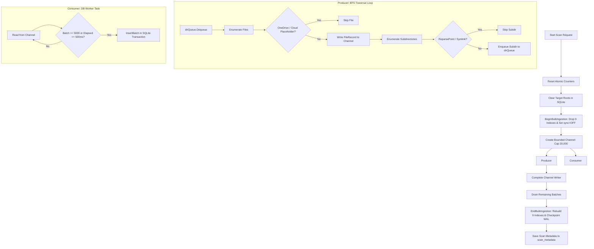
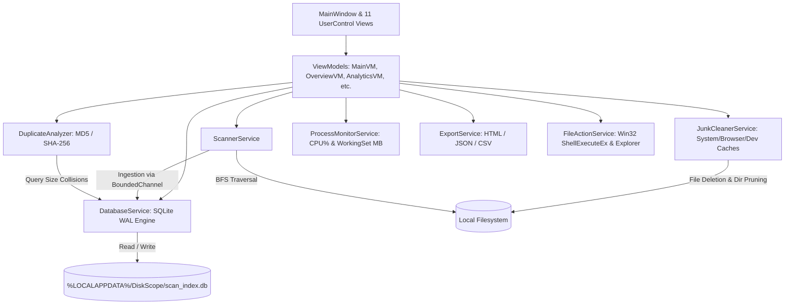

# TECHNICAL & FUNCTIONAL AUDIT REPORT: DISKSCOPE PRO

**Audit Date:** October 2026  
**Target Codebase:** DiskScope Desktop Application (WPF / .NET 8.0)  
**Corpus / Repository:** `12valor/C-file-scanner`  
**Application Title:** DiskScope — Windows Storage Analyzer (v1.0.0)  
**Execution Environment:** Windows x64  
**Audit Type:** Objective Technical & Functional Verification (Codebase-Verified Only)

---

## 1. Application Summary

| Property | Verified Value in Codebase |
| :--- | :--- |
| **Product / Assembly Title** | `DiskScope` (Product: `DiskScope Windows Storage Analyzer`) |
| **Version** | `1.0.0` (Defined in `DiskScope.csproj`) |
| **Target Framework** | `.NET 8.0 Windows` (`net8.0-windows`), Platform Target `x64` |
| **UI Framework** | Windows Presentation Foundation (WPF) with XAML |
| **Architecture Pattern** | MVVM (Model-View-ViewModel) using custom `ObservableObject` and `RelayCommand` |
| **Primary Storage Engine** | Embedded SQLite via `Microsoft.Data.Sqlite` (v8.0.10) in Write-Ahead Logging (WAL) mode |
| **Database File Location** | `%LOCALAPPDATA%\DiskScope\scan_index.db` (Fallback check to `DiskScopePro` folder) |
| **Process Model** | Single process (`DiskScope.exe`, x64) with background worker tasks for traversal, database batch insertion, and telemetry |
| **Network & Cloud Surface** | **Zero.** 100% offline desktop application. No HTTP endpoints, no cloud APIs, no telemetry |
| **Installer** | Inno Setup 6 script (`installer/installer.iss`) targeting Windows 10/11 x64 (`PrivilegesRequired=lowest`) |

---

## 2. Complete Feature Inventory

### Status Classification:
- **`[IMPLEMENTED]`**: Complete user workflow and underlying service execution are fully functional.
- **`[PARTIALLY IMPLEMENTED]`**: Feature exists and works, but with hard limits, missing edge-case handling, or restricted scope.
- **`[UI ONLY]`**: Visual elements exist in the UI, but user interactions perform no underlying operation.
- **`[CODE EXISTS BUT UNUSED]`**: Underlying C# code or queries exist in the codebase but are never invoked by the UI.

---

### Feature Audit Entries

#### 1. System Drive Auto-Discovery
- **What it does:** Enumerates all system drives, reads total and free byte capacity, volume labels, and filesystem format (`NTFS`, `FAT32`, etc.).
- **Where located:** Top Toolbar (Target Drives checkbox strip) and Overview tab.
- **How accessed:** Automatically on application launch via `DiskService.cs`.
- **Problem solved:** Eliminates manual drive letter entry.
- **Current limitations:** Only discovers drives reporting `DriveInfo.IsReady`. Automatically checks `C:` by default; other drives require manual checkbox toggle.
- **Implementation status:** `[IMPLEMENTED]`

#### 2. Custom Directory Target Selection
- **What it does:** Allows the user to select any arbitrary folder path on disk for scanning.
- **Where located:** Top Toolbar (`Folder:` text box + `Browse...` button).
- **How accessed:** Click `Browse...` (invokes Windows `OpenFolderDialog`) or manually type/paste a directory path.
- **Problem solved:** Enables scanning a specific directory without scanning an entire drive.
- **Current limitations:** Does not support scanning multiple disjoint custom directories simultaneously.
- **Implementation status:** `[IMPLEMENTED]`

#### 3. Bounded-Channel Filesystem Scanner
- **What it does:** Traverses directories via Breadth-First Search (BFS) and streams discovered records into a bounded channel for batch ingestion into SQLite.
- **Where located:** Top Toolbar (`Start Scan` / `Stop Scan` buttons).
- **How accessed:** Click `Start Scan`.
- **Problem solved:** High-speed filesystem indexing without UI lockup.
- **Current limitations:** Traversal is single-threaded BFS. No pause/resume support. No direct NTFS MFT or USN journal parsing.
- **Implementation status:** `[IMPLEMENTED]`

#### 4. Real-Time Resource Monitoring
- **What it does:** Captures DiskScope process CPU% and Working Set RAM every 1,000 ms, plotting a live 60-second line chart.
- **Where located:** Overview tab (System Resource Usage cards).
- **How accessed:** Visible on Overview tab via `ProcessMonitorService.cs`.
- **Problem solved:** Displays resource footprint during intensive scans.
- **Current limitations:** Represents DiskScope process only, not overall Windows system CPU or total system RAM usage.
- **Implementation status:** `[IMPLEMENTED]`

#### 5. Live Directory Rolling Feed
- **What it does:** Displays a rolling FIFO buffer of recent directories being actively scanned.
- **Where located:** Overview tab (`LIVE DIRECTORY FEED`).
- **How accessed:** Automatically streams during scan execution.
- **Problem solved:** Provides immediate visual feedback that scanning is actively progressing.
- **Current limitations:** UI displays maximum of 60 items; UI updates are throttled to 35 ms.
- **Implementation status:** `[IMPLEMENTED]`

#### 6. Authoritative Index Integrity Verification
- **What it does:** Executes SQLite `PRAGMA integrity_check;` and reports validation status.
- **Where located:** Overview tab (Bottom status banner).
- **How accessed:** Automatically evaluated at the completion of every scan.
- **Problem solved:** Confirms that local SQLite database is uncorrupted.
- **Current limitations:** Only reports "ok" vs failure; does not provide automated database repair.
- **Implementation status:** `[IMPLEMENTED]`

#### 7. Historical Scan Session Tracking & Growth Chart
- **What it does:** Records scan metadata into `scan_metadata` table and renders an SVG/Canvas growth polyline with interactive tooltips.
- **Where located:** Analytics tab (Storage Growth Over Time + Historical Scan Sessions table).
- **How accessed:** Navigate to Analytics tab.
- **Problem solved:** Tracks storage volume changes between scan checkpoints.
- **Current limitations:** File records from previous scans are wiped during new scans; only high-level summary metadata is retained historically.
- **Implementation status:** `[IMPLEMENTED]`

#### 8. File Age Distribution Analysis
- **What it does:** Groups indexed files into 5 temporal age buckets based on `modified_time` (<7d, 7–30d, 30–90d, 90–365d, 1yr+).
- **Where located:** Analytics tab.
- **How accessed:** Navigate to Analytics tab.
- **Problem solved:** Visualizes dormant storage vs actively modified data.
- **Current limitations:** Static time brackets hardcoded in SQL; cannot configure custom age boundaries.
- **Implementation status:** `[IMPLEMENTED]`

#### 9. File Category Breakdown
- **What it does:** Categorizes files into 9 predefined categories (Photoshop, Images, Video, Audio, Archives, Documents, Code, Executables, Other) and calculates count, volume, and percentage.
- **Where located:** File Types tab and Analytics tab.
- **How accessed:** Navigate to File Types or Analytics tab.
- **Problem solved:** Identifies which media/file types consume the most disk space.
- **Current limitations:** Purely an informational summary. Clicking a category row does not drill down or filter files.
- **Implementation status:** `[IMPLEMENTED]`

#### 10. Largest Files Browser with Paging
- **What it does:** Virtualized table displaying indexed files sorted by size descending with 100-item pagination.
- **Where located:** Largest Files tab.
- **How accessed:** Navigate to Largest Files tab.
- **Problem solved:** Quickly locates space-hogging individual files.
- **Current limitations:** Pagination is fixed at 100 items per page. No multi-file selection. No delete action.
- **Implementation status:** `[IMPLEMENTED]`

#### 11. Largest Files Filtering (Size, Category, Search)
- **What it does:** Filters largest files via Minimum Size dropdown, Category dropdown, and Name/Path substring search.
- **Where located:** Largest Files tab (Filter Toolbar).
- **How accessed:** Select dropdown values or type search text.
- **Problem solved:** Narrowing down large files by type or name.
- **Current limitations:** Search uses SQL `LIKE %search%` (case-insensitive substring match only; no regex or wildcards). Size filter uses 9 fixed presets.
- **Implementation status:** `[IMPLEMENTED]`

#### 12. Largest Folders Aggregation
- **What it does:** Displays directories consuming the most storage space.
- **Where located:** Largest Folders tab.
- **How accessed:** Navigate to Largest Folders tab.
- **Problem solved:** Locates bulky directories.
- **Current limitations:** Aggregates files strictly by their immediate `parent` directory (`GROUP BY parent`). Does not compute recursive nested directory subtree sums.
- **Implementation status:** `[PARTIALLY IMPLEMENTED]`

#### 13. Old Files Inspection (180d+)
- **What it does:** Displays large files unmodified for at least 30, 90, 180, 365, or 730 days.
- **Where located:** Old Files (180d+) tab.
- **How accessed:** Navigate to Old Files tab.
- **Problem solved:** Identifies abandoned files for archival.
- **Current limitations:** Hardcoded SQL limit of 300 files. Read-only inspection; no deletion or archival actions available.
- **Implementation status:** `[IMPLEMENTED]`

#### 14. Duplicate File Detection Engine
- **What it does:** Identifies exact file duplicates via a 3-step pipeline: (1) SQLite size collision lookup, (2) Partial head/tail MD5 hash (8 KB), (3) Full SHA-256 confirmation.
- **Where located:** Duplicates tab.
- **How accessed:** Click `Start Duplicate Analysis`.
- **Problem solved:** Finds wasted space from redundant identical copies.
- **Current limitations:** Analyzes maximum of 1,000 size-collision groups. Only evaluates files >= 1,024 bytes. Analysis results are kept only in memory and not stored in SQLite. No delete or deduplicate action.
- **Implementation status:** `[IMPLEMENTED]`

#### 15. Junk & Cache Scanner
- **What it does:** Scans 15 hardcoded directory targets across Windows temp, browser caches, and developer package stores.
- **Where located:** Junk & Cache Cleaner tab.
- **How accessed:** Click `Scan Caches` or automatic initial scan.
- **Problem solved:** Identifies reclaimable temporary and cache storage.
- **Current limitations:** Only scans 15 predefined global targets. Does NOT discover workspace-level developer junk (`node_modules`, `bin`, `obj`, `.git`).
- **Implementation status:** `[IMPLEMENTED]`

#### 16. Junk File Inspection Drawer
- **What it does:** Displays a slide-out drawer listing individual discovered files (up to 500) for a selected junk target.
- **Where located:** Junk & Cache Cleaner tab (Click `Inspect Files`).
- **How accessed:** Click `Inspect Files` on any target row.
- **Problem solved:** Allows user to inspect exact file names, sizes, and timestamps before deleting.
- **Current limitations:** Capped at 500 preview items. Cannot deselect individual files within a target.
- **Implementation status:** `[IMPLEMENTED]`

#### 17. Safe Permanent Junk Deletion
- **What it does:** Permanently deletes files in selected junk targets using `FileInfo.Delete()`, skips locked/in-use files without terminating batch, and removes newly empty subdirectories.
- **Where located:** Junk & Cache Cleaner tab (`Clean Selected` button).
- **How accessed:** Select targets, click `Clean Selected`, confirm prompt.
- **Problem solved:** Reclaims storage occupied by system, browser, and package caches.
- **Current limitations:** Deletion is permanent; does NOT move files to the Windows Recycle Bin. Locked files are skipped.
- **Implementation status:** `[IMPLEMENTED]`

#### 18. Interactive Squarified Treemap
- **What it does:** Computes squarified space-filling treemap rectangles (Bruls et al. algorithm) colored by file category.
- **Where located:** Visual Space Treemap tab.
- **How accessed:** Navigate to Treemap tab.
- **Problem solved:** Provides an intuitive spatial view of disk consumption.
- **Current limitations:** Renders maximum 150 items per level. Single hierarchy level displayed at a time (flat sibling view).
- **Implementation status:** `[IMPLEMENTED]`

#### 19. Treemap Drill-Down & Breadcrumb Navigation
- **What it does:** Double-clicking a folder rectangle drills down into that folder. Breadcrumb trail and "Up" button enable ascending the folder tree.
- **Where located:** Visual Space Treemap tab.
- **How accessed:** Double-click folder rectangle, click breadcrumb segments, or click `⬆ Up`.
- **Problem solved:** Navigating deep directory hierarchies visually.
- **Current limitations:** Only works on folders; double-clicking a file merely selects it.
- **Implementation status:** `[IMPLEMENTED]`

#### 20. Photoshop Intelligence Module
- **What it does:** Specialized breakdown of Photoshop storage: `.psd` documents, `.psb` large documents (>2 GB), presets/assets (`.abr`, `.asl`, `.atn`, `.pat`), and Adobe scratch/cache files.
- **Where located:** Photoshop Intelligence tab.
- **How accessed:** Navigate to Photoshop tab.
- **Problem solved:** Targeted storage accounting for creative professionals with huge PSD/PSB assets.
- **Current limitations:** Displays top 300 files maximum. Read-only inspection; no deletion or purge action.
- **Implementation status:** `[IMPLEMENTED]`

#### 21. Scan Diagnostics & Error Log
- **What it does:** Logs scanner events (INFO, WARN, ERROR) and detailed records of inaccessible or skipped filesystem paths.
- **Where located:** Scan Diagnostics & Log tab.
- **How accessed:** Navigate to Scan Diagnostics & Log tab.
- **Problem solved:** Provides full auditability for skipped or permission-denied entries.
- **Current limitations:** Rolling in-memory buffer capped at 500 items. Cleared on each new scan.
- **Implementation status:** `[IMPLEMENTED]`

#### 22. Multi-Format Report Export
- **What it does:** Exports scan audits to Executive HTML, structured JSON, and CSV files (Files, Duplicates, Junk).
- **Where located:** Top Toolbar (`Export Report ▾` button) and individual tabs.
- **How accessed:** Click `Export Report ▾` dropdown or tab-level `Export CSV` buttons.
- **Problem solved:** Sharing audit reports with clients, team members, or external tools.
- **Current limitations:** CSV export from "Largest Files" only exports the currently visible page (100 rows).
- **Implementation status:** `[IMPLEMENTED]`

#### 23. Windows Explorer Integration & Shell Properties
- **What it does:** Context menu options: "Open File" (default shell association), "Reveal in Explorer" (`explorer.exe /select,"{path}"`), "Copy Path" (clipboard retry loop), and "Properties" (Win32 `ShellExecuteEx` properties dialog).
- **Where located:** Context menus across Largest Files, Largest Folders, Old Files, Duplicates, Photoshop, and Treemap.
- **How accessed:** Right-click any row/item or use bottom action buttons.
- **Problem solved:** Seamless navigation between DiskScope and Windows Explorer.
- **Current limitations:** No file modification or deletion actions exist in these context menus.
- **Implementation status:** `[IMPLEMENTED]`

---

## 3. Tab-by-Tab Audit

The sidebar of `MainWindow.xaml` defines 11 distinct views:

```
Sidebar Navigation:
├── [1] Overview
├── [2] Analytics
├── [3] Largest Files
├── [4] Largest Folders
├── [5] File Types
├── [6] Old Files (180d+)
├── [7] Duplicates
├── [8] Junk & Cache Cleaner
├── [9] Visual Space Treemap
├──────── (Separator) ────────
├── [10] Photoshop Intelligence
└── [11] Scan Diagnostics & Log
```

### Tab 1: OVERVIEW (`OverviewView.xaml` / `OverviewViewModel.cs`)
- **Current functionality:** Real-time dashboard during scanning and post-scan summary.
- **Data displayed:**
  - Drive Allocation (Filesystem Used, Free, Total, progress bar).
  - Scan Accounting (Files Indexed, Files Skipped, Dirs Processed, Dirs Skipped).
  - Scan Status & Speed (Storage Indexed, Scan State, Elapsed Time, Throughput).
  - System Resource Usage (CPU% and Working Set RAM in MB via `RealtimeMetricGraph`).
  - Live Directory Feed (rolling FIFO buffer of recent directories).
  - Scan Integrity Banner (`PRAGMA integrity_check`).
- **Actions available:** Select target drives, browse custom folder, start/stop scan.
- **Background processes:** `ProcessMonitorService` (1,000 ms timer) and `ScannerService` progress reporting (40 ms throttle).
- **Limitations:** Cannot pause/resume scan; CPU/RAM charts represent DiskScope only, not the full Windows OS.

### Tab 2: ANALYTICS (`AnalyticsView.xaml` / `AnalyticsViewModel.cs`)
- **Current functionality:** Aggregate intelligence derived from the SQLite index and past scan history.
- **Data displayed:**
  - Row 1: Storage Allocation & Indexed Footprint + Canvas Storage Growth Over Time chart with interactive tooltips.
  - Row 2: Potentially Reclaimable Storage Callout (Dormant Files 180d+, Duplicate Redundancy, Adobe Cache & Scratch, Temporary/Log/Backup).
  - Row 3: File Age Distribution (<7d, 7–30d, 30–90d, 90–365d, 1yr+) + File Categories & Format Breakdown.
  - Row 4: Top 8 Folders Consuming Storage + Photoshop / Duplicate summary metrics.
  - Row 5: Historical Scan Sessions & Storage Growth DataGrid (Session ID, Date, Scanned Target, Files Indexed, Storage Indexed, Growth Delta, Duration, Status).
- **Actions available:** `Refresh Analytics` button.
- **Background processes:** Background aggregate SQL queries via `Task.Run()`.
- **Limitations:** Historical comparison is limited to session metadata (no historical per-file diffs); Reclaimable card is an estimate and does not provide inline cleaning actions.

### Tab 3: LARGEST FILES (`LargestFilesView.xaml` / `LargestFilesViewModel.cs`)
- **Current functionality:** Paginated, filterable browser for space-consuming files.
- **Data displayed:**
  - Virtualized DataGrid: File Name, Logical Size, Category, Modified Date, Full Path.
  - Selected File Detail Panel (bottom): Name, Path, Logical Size (formatted and exact bytes), Category, Extension, Modified, Created.
  - Pagination summary (e.g. `Page 1 of 45 (4,420 total matching files)`).
- **Actions available:**
  - Filter by Minimum Size (9 presets: All, 1KB, 100KB, 1MB, 10MB, 50MB, 100MB, 500MB, 1GB).
  - Filter by Category (All + 9 categories).
  - Live search (`name LIKE %search% OR path LIKE %search%`).
  - Next / Previous page buttons (100 files per page).
  - Context menu / quick actions: `Open File`, `Open File Location`, `Copy Absolute Path`, `Properties`.
  - Double-click row opens file.
  - `Export CSV` button.
- **Background processes:** Background SQL queries (`GetFilesPaged` and `GetFilteredFileCount`).
- **Limitations:** **Zero file deletion capabilities**; `Export CSV` only exports the currently visible 100-item page; no multi-file selection.

### Tab 4: LARGEST FOLDERS (`LargestFoldersView.xaml` / `LargestFoldersViewModel.cs`)
- **Current functionality:** Identifies directories consuming the most disk storage.
- **Data displayed:**
  - DataGrid: Directory Name, Aggregated Size, Storage Distribution ProgressBar, Indexed Files count, Full Path.
  - Selected folder detail panel.
- **Actions available:** `Open in Explorer`, `Copy Path`, `Refresh Folders`, double-click row opens folder.
- **Background processes:** SQLite query `SELECT parent, SUM(size), COUNT(id) FROM files GROUP BY parent ORDER BY total_size DESC LIMIT 150`.
- **Limitations:** **Non-recursive parent grouping:** Only calculates files directly residing in that directory; nested subdirectory trees are not recursively rolled up into parent folder sums. No folder deletion actions.

### Tab 5: FILE TYPES (`FileTypesView.xaml` / `FileTypesViewModel.cs`)
- **Current functionality:** High-level storage allocation by file classification.
- **Data displayed:**
  - Total Indexed Storage and Total Indexed Files cards.
  - DataGrid: Category, Total Size, Storage Share % (ProgressBar + formatted %), File Count.
- **Actions available:** Informational viewing only.
- **Background processes:** Aggregate SQL query `SELECT category, COUNT(id), SUM(size) FROM files GROUP BY category`.
- **Limitations:** Purely informational summary; clicking a category does not drill down or filter files.

### Tab 6: OLD FILES (180d+) (`OldFilesView.xaml` / `OldFilesViewModel.cs`)
- **Current functionality:** Identifies large abandoned/dormant files unwritten for extended periods.
- **Data displayed:**
  - Subtitle explicitly declares: *"Identify large files unwritten for long periods (analysis only; read-only inspection)"*.
  - DataGrid of top 300 old files: File Name, Logical Size, Last Modified, Category, Full Absolute Path.
  - Selected file detail panel.
- **Actions available:** Filter by age preset (`30+`, `90+`, `180+`, `365+`, `730+` days), `Refresh Analysis`, `Open File`, `Reveal in Explorer`, `Copy Path`, `Properties`.
- **Background processes:** Background SQL query filtering by `modified_time <= cutoff AND size > 0 ORDER BY size DESC LIMIT 300`.
- **Limitations:** Strictly read-only analysis; hard limit of 300 files; no deletion or archival actions.

### Tab 7: DUPLICATES (`DuplicatesView.xaml` / `DuplicateViewModel.cs`)
- **Current functionality:** Cryptographically verified duplicate file detection.
- **Data displayed:**
  - Status banner with Potential Recoverable Storage metric.
  - Master-Detail layout:
    - Left: Confirmed duplicate collision groups (Size, wasted space, copy count, truncated SHA-256).
    - Right: Files in selected duplicate group (File Name, Modified, Absolute Path).
  - Selected duplicate file action bar.
- **Actions available:** `Start Duplicate Analysis`, `Stop Analysis`, `Export CSV`, `Open File`, `Reveal in Explorer`, `Copy Path`, `Properties`.
- **Background processes:** 3-step pipeline: (1) SQLite size collision lookup, (2) Partial head/tail MD5 hash, (3) Full SHA-256 confirmation.
- **Limitations:** **Zero duplicate cleanup:** No delete, deduplicate, or hardlink options exist. Groups are held only in memory (not saved to SQLite). Ignores files < 1,024 bytes; limited to top 1,000 candidate size collision groups.

### Tab 8: JUNK & CACHE CLEANER (`JunkCleanerView.xaml` / `JunkCleanerViewModel.cs`)
- **Current functionality:** Scans and purges temporary files, crash dumps, browser caches, and developer package stores.
- **Data displayed:**
  - Total Cleanable Space and Selected to Clean cards.
  - Progress bar with percentage and current file name.
  - Categorized targets list across 3 groups (System, Browser, Developer) with checkboxes, size, file count, and status badges.
  - Right slide-out File Inspector Drawer showing up to 500 files per target (Name, Size, Modified).
- **Actions available:** `Select All`, `Deselect All`, `Scan Caches`, `Clean Selected`, `Cancel`, `Inspect Files`, `Open Folder`, `Export CSV`.
- **Background processes:** Asynchronous traversal (`ScanTargetAsync`) and permanent deletion (`CleanTargetsAsync`).
- **Safety & Error Handling:** Clears read-only attributes, skips locked/in-use files (`IOException`) and permission-denied files (`UnauthorizedAccessException`) without crashing, deletes empty subdirectories, displays confirmation modal.
- **Limitations:** **Permanent deletion only:** Files are deleted via `FileInfo.Delete()` and NOT moved to the Recycle Bin. Scans only 15 hardcoded global cache targets; **zero support** for project `node_modules`, `bin`, or `obj` folders.

### Tab 9: VISUAL SPACE TREEMAP (`TreemapView.xaml` / `TreemapViewModel.cs`)
- **Current functionality:** Interactive squarified treemap visualization showing proportional file and folder space allocation.
- **Data displayed:**
  - 2D Canvas with colored rectangles computed via Bruls et al. squarified algorithm.
  - Category color legend bar.
  - Interactive breadcrumb navigation trail with `⬆ Up` button.
  - Hover tooltips: Name, Path, Category, Formatted Size, Share of view %.
  - Bottom Selected Item Panel: Name, Category, Path, Formatted Size, % of view.
- **Actions available:**
  - Double-click folder rectangle to drill down.
  - Single-click to select (yellow border highlight).
  - Breadcrumb and `⬆ Up` navigation.
  - `Open in Explorer`, `Copy Path`, `Refresh`.
- **Background processes:** `TreemapLayoutEngine.ComputeLayout` and SQLite queries for current level items.
- **Limitations:** Renders maximum 150 items per level; flat single-level view; no file operations (no delete, rename, or move).

### Tab 10: PHOTOSHOP INTELLIGENCE (`PhotoshopView.xaml` / `PhotoshopViewModel.cs`)
- **Current functionality:** Storage intelligence for Adobe Photoshop documents, presets, and caches.
- **Data displayed:**
  - Summary cards: PSD Documents, PSB Large Documents (>2 GB), Assets & Presets (`.abr`, `.asl`, `.atn`, `.pat`), Total Photoshop Storage.
  - DataGrid of top 300 Photoshop files sorted by size descending.
  - Selected Document detail panel.
- **Actions available:** `Open in Photoshop`, `Reveal in Explorer`, `Copy Path`, `Properties`.
- **Background processes:** Asynchronous SQL query filtering for Photoshop extensions and Adobe paths.
- **Limitations:** Purely read-only inspection; hard limit of 300 files; no purge or cleanup actions.

### Tab 11: SCAN DIAGNOSTICS & LOG (`ScanLogView.xaml` / `ScanLogViewModel.cs`)
- **Current functionality:** Detailed audit trail of scanner events and skipped filesystem entries.
- **Data displayed:**
  - Tab 1: Events & Diagnostics (Timestamp, Level [INFO, WARN, ERROR], Message, Technical Detail).
  - Tab 2: Skipped & Inaccessible Entries (Item Type [Directory, File], Skipped Path, Windows Filesystem Reason).
- **Actions available:** View log entries.
- **Background processes:** Ingestion from `ScannerService` progress callbacks.
- **Limitations:** Rolling in-memory buffer capped at 500 items per tab; cleared on every new scan; no direct export button from this tab.

---

## 4. Scanning System Audit



### Detailed Scanner Implementation Facts:
- **Discovery Method:** Sequential Breadth-First Search (BFS) using a single `Queue<string> dirQueue` on a background thread (`ScannerService.cs:187-361`).
- **Ingestion Pipeline:** Producer-consumer pattern using `System.Threading.Channels.Channel.CreateBounded<FileRecord>(20000)` with `BoundedChannelFullMode.Wait` (`ScannerService.cs:81-86`).
- **Parallelism:** Traversal loop is single-threaded; SQLite ingestion runs concurrently on a separate worker task (`ScannerService.cs:97-171`).
- **Batch Processing:** Records are accumulated and inserted in batches of up to 5,000 files in a single transaction, or flushed every 500 ms (`ScannerService.cs:99-146`).
- **Cancellation:** Evaluates `cancellationToken.IsCancellationRequested` at file enumeration, directory traversal, and channel read/write steps. Marks state as `ScanState.Cancelled`, drains remaining channel items, and completes index recreation cleanly (`ScannerService.cs:192, 225, 314`).
- **Pause / Resume:** **`[NOT IMPLEMENTED]`** No pause mechanism exists in the codebase.
- **Progress Reporting:** `ScanProgressReport` emitted via `IProgress<T>` throttled to at least 40 ms intervals.
- **Atomic Accounting:** 7 atomic counters updated via `Interlocked`: `_directoriesVisited`, `_directoriesProcessed`, `_directoriesSkipped`, `_filesDiscovered`, `_filesIndexed`, `_filesSkipped`, `_logicalBytesIndexed`.
- **Symlinks & Reparse Points:** Explicitly skipped: `(di.Attributes & FileAttributes.ReparsePoint) != 0` (`ScannerService.cs:321-325`).
- **Cloud Placeholders:** Explicitly skips OneDrive dehydrated files (`RecallOnDataAccess = 0x00400000`, `RecallOnOpen = 0x00040000`) (`ScannerService.cs:228-233`).
- **Duplicate Traversal Prevention:** Case-insensitive `HashSet<string> visitedPaths` tracking normalized full paths (`ScannerService.cs:175, 185, 328`).
- **Error Handling:** Catches per-directory and per-file exceptions, records the first 500 skipped entries in a `ConcurrentBag`, and continues traversal.
- **NTFS Specifics:** Uses standard Win32 .NET IO (`DirectoryInfo.EnumerateFiles`, `Directory.EnumerateDirectories`). **Does not use USN Journal or MFT direct parsing.**
- **Throughput Calculation:** `FilesPerSecond = totalIndexed / totalElapsedSeconds` (cumulative average from scan start).

---

## 5. Database / Indexing Audit

### Configuration:
- **Engine:** `Microsoft.Data.Sqlite` (v8.0.10).
- **File Location:** `%LOCALAPPDATA%\DiskScope\scan_index.db`.
- **Connection Mode:** `SqliteOpenMode.ReadWriteCreate`, `SqliteCacheMode.Shared`.
- **Active PRAGMAs:**
  - `PRAGMA journal_mode = WAL;`
  - `PRAGMA synchronous = NORMAL;` (Switched to `OFF` during bulk ingestion).
  - `PRAGMA temp_store = MEMORY;`
  - `PRAGMA cache_size = -64000;` (64 MB cache).

### Schema Architecture:
```sql
CREATE TABLE IF NOT EXISTS files (
    id INTEGER PRIMARY KEY AUTOINCREMENT,
    path TEXT NOT NULL UNIQUE,
    name TEXT NOT NULL,
    parent TEXT NOT NULL,
    size INTEGER NOT NULL,
    modified_time REAL NOT NULL,
    created_time REAL NOT NULL,
    extension TEXT,
    category TEXT,
    accessible INTEGER NOT NULL DEFAULT 1
);

CREATE TABLE IF NOT EXISTS scan_metadata (
    id INTEGER PRIMARY KEY AUTOINCREMENT,
    scan_start REAL,
    scan_finish REAL,
    roots TEXT,
    directories_visited INTEGER,
    directories_processed INTEGER,
    directories_skipped INTEGER,
    files_discovered INTEGER,
    files_indexed INTEGER,
    files_skipped INTEGER,
    logical_bytes_indexed INTEGER,
    scan_status TEXT
);
```

### Ingestion Index Optimization:
During normal operation, 9 indexes exist on `files`: `size`, `parent`, `(parent, size)`, `modified_time`, `(modified_time, size)`, `extension`, `category`, `(category, size)`, and `name`.
- Before scan ingestion (`BeginBulkIngestion`): Drops all 9 indexes and sets `PRAGMA synchronous = OFF;`.
- After scan completion (`EndBulkIngestion`): Re-creates all 9 indexes, restores `PRAGMA synchronous = NORMAL;`, and runs `PRAGMA wal_checkpoint(PASSIVE);`.

### Incremental vs Overwrite Behavior:
- **Scans are NOT incremental.**
- Prior to scanning, `ClearIndex(roots)` is called:
  - If scanning drive roots: Executes `DELETE FROM files;`.
  - If scanning subfolders: Executes B-tree range deletion:
    `WHERE path = $root COLLATE NOCASE OR (path >= $prefix AND path < $prefixUpper);`.
- All files under the target root are wiped and re-indexed from scratch.

### Historical Retention & Maintenance:
- Scan sessions in `scan_metadata` are permanently retained.
- Past file records are deleted when their root is rescanned (no historical file-level diffing).
- `VACUUM` is **NOT implemented**. The database file never shrinks automatically.
- Database integrity is verified via `PRAGMA integrity_check;`.

---

## 6. Visualization Audit

### 1. Interactive Squarified Treemap (`TreemapLayoutEngine.cs` / `TreemapView.xaml`)
- **Algorithm:** Squarified Treemap Layout (Bruls, Huizing, van Wijk algorithm).
- **Layout Math:** Calculates aspect ratios to approach 1.0 (squares), recursively partitioning rectangles based on area proportional to file/folder byte size.
- **Rendering:** WPF Canvas rendering `Border` elements with frozen `SolidColorBrush` instances.
- **Interactive Capabilities:**
  - Hover: Displays tooltip with name, path, category, formatted size, and % share of current view.
  - Single-click: Selects node with `#FACC15` (Yellow) border highlight and populates bottom action bar.
  - Double-click folder: Drills down into folder contents.
  - Breadcrumbs & Up button: Ascends folder tree.
- **Information obtained:** Spatial distribution of storage and instant identification of space hogging folders or media files.

### 2. Real-Time Resource Metric Graph (`RealtimeMetricGraph.cs`)
- **Implementation:** Custom WPF `FrameworkElement` drawing directly into `DrawingContext`.
- **Data displayed:** 60-second live rolling line graph of CPU% and RAM (MB).
- **Styling:** Subtle dashed horizontal grid lines (25%, 50%, 75%), solid baseline, antialiased smooth polyline with round line caps and joins.
- **Overhead:** High performance; bypasses heavy charting libraries, draws in a single drawing pass with pre-frozen pens and brushes.

### 3. Historical Storage Growth Chart (`AnalyticsViewModel.cs` / `AnalyticsView.xaml`)
- **Implementation:** WPF Canvas rendering dynamic `Polygon` (linear vertical gradient fill) and `Polyline` with interactive circular nodes (`Ellipse`).
- **Interactive Tooltips:** Hovering over any scan checkpoint dot displays session timestamp, total indexed size, and file count.

### 4. Proportional Storage Bars
- **Implementation:** Standard WPF `ProgressBar` controls styled with custom track colors, representing percentage share of total storage across Drive Allocation, Largest Folders, File Age Distribution, and File Categories.

---

## 7. File Management & Cleanup Audit

| Operation | Implemented? | Implementation Details |
| :--- | :--- | :--- |
| **Delete from Largest Files** | **NO** | No deletion commands, buttons, or context menu items exist. |
| **Delete from Largest Folders** | **NO** | No deletion commands, buttons, or context menu items exist. |
| **Delete from Old Files** | **NO** | Explicitly marked as read-only analysis in subtitle. |
| **Delete from Duplicates** | **NO** | Detects duplicates but provides no deletion or deduplication actions. |
| **Delete from Treemap** | **NO** | Only "Open in Explorer" and "Copy Path" exist. |
| **Delete from Junk Cleaner** | **YES** | Permanently deletes files in selected targets via `FileInfo.Delete()`. |
| **Windows Recycle Bin Support** | **NO** | Files are NOT sent to the Recycle Bin (`Microsoft.VisualBasic.FileIO` or Win32 `SHFileOperation` are not present). |
| **Permanent Deletion** | **YES** | Direct filesystem deletion via `FileInfo.Delete()`. |
| **Empty Directory Removal** | **YES** | Automatically deletes directories that become empty after cleaning. |
| **Deletion Confirmation** | **YES** | `MessageBox.Show` displays target count, estimated bytes to free, and warning before cleaning. |
| **Pre-Deletion File Preview** | **YES** | File Inspector Drawer displays up to 500 files per target with name, size, and modified date. |
| **Undo / Recovery** | **NO** | Zero undo, snapshot, or recovery capabilities exist. |
| **System / Protected File Safety** | **PARTIAL** | Skips reparse points/symlinks; catches `IOException` (in-use files) and `UnauthorizedAccessException` without crashing. |

---

## 8. Developer Junk Detection Audit

### Detailed Comparison: Marketing Claims vs Code Reality

| Target / Category | Mentioned in Website / Docs? | Exists in `JunkCleanerService.cs`? | Detection Path / Rule | Deletable in App? | Consequences Warning? |
| :--- | :--- | :--- | :--- | :--- | :--- |
| **`node_modules`** | **YES** (Claimed on site) | **NO** | **NOT IMPLEMENTED.** Zero scanning logic exists for project `node_modules`. | No | None |
| **`bin` / `obj`** | **YES** (Claimed on site) | **NO** | **NOT IMPLEMENTED.** Zero scanning logic exists for `bin` or `obj`. | No | None |
| **`.git`** | NO | **NO** | **NOT IMPLEMENTED.** | No | None |
| **Build / Dist Folders** | NO | **NO** | **NOT IMPLEMENTED.** | No | None |
| **NuGet Package Cache** | YES | **YES** | `%USERPROFILE%\.nuget\packages` | YES | Confirmation dialog only |
| **npm Global Cache** | YES | **YES** | `%APPDATA%\npm-cache` | YES | Confirmation dialog only |
| **pip Python Cache** | YES | **YES** | `%LOCALAPPDATA%\pip\cache` | YES | Confirmation dialog only |
| **Cargo Rust Cache** | YES | **YES** | `%USERPROFILE%\.cargo\registry\cache` | YES | Confirmation dialog only |
| **Gradle Cache** | YES | **YES** | `%USERPROFILE%\.gradle\caches` | YES | Confirmation dialog only |
| **User Temp Files** | YES | **YES** | `%TEMP%`, `%LOCALAPPDATA%\Temp` | YES | Confirmation dialog only |
| **Windows Temp Files** | YES | **YES** | `%WINDIR%\Temp` | YES (Requires Admin for system files) | Confirmation dialog only |
| **Update Download Cache** | YES | **YES** | `%WINDIR%\SoftwareDistribution\Download` | YES (Requires Admin) | Confirmation dialog only |
| **Crash Dumps & WER** | YES | **YES** | `%LOCALAPPDATA%\CrashDumps`, `%LOCALAPPDATA%\Microsoft\Windows\WER` | YES | Confirmation dialog only |
| **Explorer Thumbnails** | YES | **YES** | `%LOCALAPPDATA%\Microsoft\Windows\Explorer\thumbcache_*.db` | YES | Confirmation dialog only |
| **Chrome Web Cache** | YES | **YES** | `%LOCALAPPDATA%\Google\Chrome\User Data\Default\Cache`, `Code Cache` | YES | Confirmation dialog only |
| **Edge Web Cache** | YES | **YES** | `%LOCALAPPDATA%\Microsoft\Edge\User Data\Default\Cache`, `Code Cache` | YES | Confirmation dialog only |
| **Firefox Web Cache** | YES | **YES** | `%LOCALAPPDATA%\Mozilla\Firefox\Profiles\*\cache2` | YES | Confirmation dialog only |
| **Brave Web Cache** | YES | **YES** | `%LOCALAPPDATA%\BraveSoftware\Brave-Browser\User Data\Default\Cache`, `Code Cache` | YES | Confirmation dialog only |
| **Discord Electron Cache** | YES | **YES** | `%APPDATA%\discord\Cache`, `Code Cache` | YES | Confirmation dialog only |

- **Configurability:** Targets are hardcoded in C#; users cannot add, edit, or configure custom junk targets or paths.
- **Exclusion rules:** None. Entire directory contents matching pattern are cleaned.
- **Consequences Warning:** The confirmation message states *"Locked or in-use files will be safely skipped automatically"*, but does NOT warn developers that cleaning package caches (`.nuget`, `.cargo`, `npm-cache`) will require re-downloading dependencies on the next project build.

---

## 9. Search & Filtering Audit

### Search Features:
- **Location:** "Largest Files" tab only.
- **Search Query:** `WHERE size >= $minSize AND (name LIKE $search OR path LIKE $search)`.
- **Search Type:** Substring match against file name or full path.
- **Case Sensitivity:** Case-insensitive (default SQLite LIKE behavior for ASCII).
- **Wildcard / Regex Support:** None. User input is wrapped in `%{search}%`. Wildcard characters (`%`, `_`) are not escaped, but regex syntax is unsupported.
- **Live Search:** Bound with `UpdateSourceTrigger=PropertyChanged`; resets to Page 1 and refreshes on each keystroke.

### Filtering Capabilities:
- **Size Filtering:** Preset dropdown (`All files`, `1 KB`, `100 KB`, `1 MB`, `10 MB`, `50 MB`, `100 MB`, `500 MB`, `1 GB`). No custom size range input.
- **Category Filtering:** Dropdown options (`All` + 9 categories).
- **Extension Filtering:** No direct extension filter input box (only possible by typing `.ext` into the Search box).
- **Date Filtering:** Available on "Old Files" tab via presets (`30+`, `90+`, `180+`, `365+`, `730+` days). No custom date picker.
- **Sorting:** Database sort keys supported: `size`, `name`, `modified_time`, `category`, `extension`. Largest Files defaults to `size DESC`.

---

## 10. Performance Audit

- **Ingestion Pipeline:** Uses `System.Threading.Channels.Channel.CreateBounded<FileRecord>(20000)` with `BoundedChannelFullMode.Wait`. The scanner pauses traversal when the SQLite consumer falls behind, preventing unbounded memory growth.
- **Batch Processing:** Inserts batches of up to 5,000 files in a single SQLite transaction, or flushes every 500 ms.
- **Ingestion Index Dropping:** Dropping 9 indexes before scanning and re-creating them in bulk reduces B-tree rebalancing overhead from $O(N \log N)$ per insert to a single sorted index build.
- **Reported Speed:** The `FilesPerSecond` metric displayed in the UI is computed as:
  $$\text{FilesPerSecond} = \frac{\text{FilesIndexed}}{\text{TotalElapsedSeconds}}$$
  This is a cumulative average from the start of the scan, not an instantaneous sliding window.
- **Bottlenecks:**
  1. Directory traversal is sequential single-threaded BFS; scanning millions of small files is bottlenecked by Win32 metadata round-trips.
  2. Index rebuilding at the end of large scans causes a noticeable pause while 9 indexes are built and the WAL checkpoint is executed.

---

## 11. System Resource Monitoring Audit

- **CPU Measurement Source:** Sampled via `Process.GetCurrentProcess().TotalProcessorTime` normalized against `Environment.ProcessorCount` and sample duration.
  - **Crucial Fact:** This measures **DiskScope's process CPU consumption only**. It does NOT measure total system CPU usage.
- **RAM Measurement Source:** Sampled via `Process.GetCurrentProcess().WorkingSet64 / (1024 * 1024)`.
  - **Crucial Fact:** This measures **DiskScope's physical Working Set in RAM**, not overall Windows system memory.
- **Update Interval:** Fixed at 1,000 ms via `System.Threading.Timer`.
- **History Length:** Fixed ring buffer of 60 samples (60 seconds).
- **Dynamic Scale:** RAM graph ceiling dynamically adjusts in 64 MB / 128 MB increments with 25% headroom over peak observed working set.
- **Rendering Overhead:** Minimal; custom `RealtimeMetricGraph` WPF element renders directly with frozen `DrawingContext` primitives. Disables active rendering when the Overview tab is unloaded.

---

## 12. Command-Line Interface (CLI) Audit

- **CLI Implementation Status:** **`[NOT IMPLEMENTED]`**
- **Verification:**
  - `App.xaml.cs` defines `OnStartup(StartupEventArgs e)`, but completely ignores `e.Args`. It unconditionally initializes and displays `MainWindow`.
  - No command-line parser (`System.CommandLine`, `CommandLineParser`, etc.) is referenced in `DiskScope.csproj`.
  - The only CLI-related code is `tests/Program.cs` (an automated test runner accepting `--live`), which is explicitly excluded from compilation via `<Compile Remove="tests\**" />` in `DiskScope.csproj`.
- **Result:** DiskScope cannot be invoked from PowerShell or CMD with scan parameters, automated flags, or headless export options.

---

## 13. Safety Audit

| Safety Feature | Verification & Implementation State |
| :--- | :--- |
| **Confirmation Modals** | Implemented only in Junk Cleaner prior to cleaning. Displays target count, estimated bytes, and skipped file warning. |
| **Protected Paths** | Traversal automatically skips reparse points and symlinks to prevent directory junction loops. |
| **System File Lock Handling** | Deletion handles `IOException` and `UnauthorizedAccessException` per file, logging them as skipped and continuing the batch. |
| **Recycle Bin Integration** | **NOT IMPLEMENTED.** Deletions are permanent via `FileInfo.Delete()`. |
| **Administrator Privileges** | Application runs at standard user integrity (`asInvoker`). Cleaning `%WINDIR%\Temp` or `%WINDIR%\SoftwareDistribution` will skip protected files unless user manually right-clicks and selects "Run as administrator". |
| **Read-Only Overwrite** | Junk cleaner automatically clears the read-only attribute (`fi.IsReadOnly = false`) before deleting. |
| **Undo / Rollback** | **NOT IMPLEMENTED.** No recovery mechanism exists. |

---

## 14. Settings / Configuration Audit

- **Configuration File:** **None.** (No `appsettings.json`, no `App.config`, no `.ini` file, no Windows Registry configuration).
- **Settings Tab / UI:** **None.**
- **Hardcoded Defaults:**

| Setting / Constant | Hardcoded Default Value | Source Code Location |
| :--- | :--- | :--- |
| **Database Path** | `%LOCALAPPDATA%\DiskScope\scan_index.db` | `DatabaseService.cs:28` |
| **SQLite Cache Size** | `64 MB` (`-64000`) | `DatabaseService.cs:62` |
| **Ingestion Batch Size** | `5,000 files` | `ScannerService.cs:99` |
| **Channel Capacity** | `20,000 items` | `ScannerService.cs:81` |
| **Progress Report Throttle** | `40 ms` | `ScannerService.cs:212` |
| **Live Recent Dirs Buffer** | `60 items` in UI / `150 items` in scanner | `OverviewViewModel.cs:175`, `ScannerService.cs:203` |
| **Diagnostics Log Buffer** | `500 items` | `ScanLogViewModel.cs:37` |
| **Resource Monitor Interval** | `1,000 ms` | `OverviewViewModel.cs:36` |
| **Resource Monitor History** | `60 samples` (60 seconds) | `ProcessMonitorService.cs:42` |
| **Old Files Default Cutoff** | `180 days` | `OldFilesViewModel.cs:14` |
| **Duplicate Candidate Limit** | `1,000 size groups` | `DuplicateViewModel.cs:121` |
| **Duplicate Minimum Size** | `1,024 bytes` (1 KB) | `DuplicateViewModel.cs:120` |
| **Largest Files Page Size** | `100 files` | `LargestFilesViewModel.cs:15` |
| **Largest Folders Query Limit** | `150 directories` | `LargestFoldersViewModel.cs:69` |
| **Treemap Items Limit** | `150 items` per level | `TreemapViewModel.cs:165` |
| **Photoshop Query Limit** | `300 documents` | `PhotoshopViewModel.cs:111` |

---

## 15. External Dependencies

### 1. Target Framework & Runtime:
- `net8.0-windows` (Microsoft .NET 8.0 SDK, Windows Desktop runtime).

### 2. NuGet Packages:
- `Microsoft.Data.Sqlite` (v8.0.10): Embedded ADO.NET provider for SQLite. Used for all catalog storage, queries, and WAL-mode transaction management.

### 3. Native Win32 APIs:
- `shell32.dll` (`ShellExecuteEx`): Invoked in `FileActionService.cs` using verb `"properties"` (`SEE_MASK_INVOKEIDLIST`) to display the native Windows file properties dialog.

### 4. External Services / Cloud APIs:
- **None.** Zero third-party web services, zero telemetry endpoints, zero cloud integrations.

---

## 16. Implementation Gaps

This section records discrepancies between marketing text / documentation and the actual codebase:

1. **Website Claim vs Code: Developer Junk (`node_modules`, `bin`, `obj`)**
   - **Claim:** Marketing site (`site/index.html`) states: *"Targeted discovery of orphaned build artifacts (node_modules, .gradle/caches, .cargo/registry, bin/obj)"*.
   - **Reality:** In `JunkCleanerService.cs`, only global package stores (`.nuget`, `npm-cache`, `pip`, `.cargo`, `.gradle`) are scanned. There is **zero implementation** for detecting or cleaning project-level `node_modules`, `bin`, or `obj` directories.

2. **README Claim vs Code: Windows Recycle Bin**
   - **Claim:** `README.md` states: *"Safe deletion: Sends files to the Windows Recycle Bin or deletes permanently on confirmation."*
   - **Reality:** Files are deleted permanently via `FileInfo.Delete()`. There is **zero implementation** of Windows Recycle Bin integration anywhere in the application.

3. **Largest Folders Non-Recursive Grouping**
   - **UI Impression:** The Largest Folders tab presents a hierarchy of folders consuming storage.
   - **Reality:** The underlying query groups strictly by immediate `parent` (`GROUP BY parent`). It only calculates files residing directly in that parent folder. Subdirectories nested deeper are not summed into parent folder totals.

4. **Largest Files CSV Export Scope**
   - **UI Impression:** Clicking `Export CSV` on the Largest Files tab appears to export all matching files.
   - **Reality:** It only exports the currently loaded page (`Files` collection, max 100 rows).

5. **Category Drill-Down Absence**
   - **UI Impression:** The File Types tab lists categories with storage bars.
   - **Reality:** Clicking or double-clicking any category row does nothing; there is no drill-down into files of that category.

6. **Missing Delete Actions Across Analysis Tabs**
   - **UI Impression:** Largest Files, Largest Folders, Old Files, and Duplicates tabs identify storage waste.
   - **Reality:** None of these tabs contain deletion, quarantine, or cleanup buttons. Users must manually reveal files in Explorer to delete them.

7. **Duplicate Analysis In-Memory Only**
   - Duplicate analysis results are held in memory and discarded when navigating away or closing the app; they are not saved in the SQLite database.

8. **Hardcoded Configuration**
   - Zero settings, zero configuration options, and zero customization for database paths, batch sizes, or scan exclusions.

---

## 17. Complete Feature Matrix

| Area | Feature | Status | Actually Works? | User Access | Main Limitation |
| :--- | :--- | :--- | :--- | :--- | :--- |
| **Scanner** | System Drive Discovery | `[IMPLEMENTED]` | Yes | Top Toolbar / Overview | Only drives reporting `IsReady`. |
| **Scanner** | Custom Folder Scanning | `[IMPLEMENTED]` | Yes | Top Toolbar (`Browse...`) | Single folder target at a time. |
| **Scanner** | BFS Directory Traversal | `[IMPLEMENTED]` | Yes | Top Toolbar (`Start Scan`) | Single-threaded traversal loop. |
| **Scanner** | Bounded Channel Ingestion | `[IMPLEMENTED]` | Yes | Background during scan | Producer waits if queue reaches 20,000. |
| **Scanner** | Batch SQLite Insertion | `[IMPLEMENTED]` | Yes | Background during scan | 5,000 files or 500 ms per transaction. |
| **Scanner** | Scan Cancellation | `[IMPLEMENTED]` | Yes | Top Toolbar (`Stop Scan`) | Stops cleanly; preserves indexed data so far. |
| **Scanner** | Pause / Resume Scan | `[NOT IMPLEMENTED]` | No | None | No pause mechanism in code. |
| **Scanner** | Symlink / Junction Skip | `[IMPLEMENTED]` | Yes | Automatic in scanner | Reparse points completely ignored. |
| **Scanner** | Cloud Placeholder Skip | `[IMPLEMENTED]` | Yes | Automatic in scanner | OneDrive dehydrated files skipped. |
| **Scanner** | Duplicate Path Prevention | `[IMPLEMENTED]` | Yes | Automatic in scanner | Case-insensitive path set check. |
| **Database** | SQLite WAL Storage | `[IMPLEMENTED]` | Yes | Automatic | Stored in `%LOCALAPPDATA%\DiskScope`. |
| **Database** | Index Dropping Optimization | `[IMPLEMENTED]` | Yes | Automatic during scan | 9 indexes dropped during ingestion. |
| **Database** | Incremental Scanning | `[NOT IMPLEMENTED]` | No | None | Target roots are cleared before scanning. |
| **Database** | Historical Session Tracking | `[IMPLEMENTED]` | Yes | Analytics tab (Row 5) | Only metadata retained; per-file diffs absent. |
| **Database** | Database Integrity Check | `[IMPLEMENTED]` | Yes | Overview status bar | `PRAGMA integrity_check` validation. |
| **Database** | Database Vacuuming | `[NOT IMPLEMENTED]` | No | None | No `VACUUM` command in codebase. |
| **Monitoring** | Process CPU Tracking | `[IMPLEMENTED]` | Yes | Overview tab | DiskScope process only, not whole system. |
| **Monitoring** | Process RAM Tracking | `[IMPLEMENTED]` | Yes | Overview tab | DiskScope working set only, not total system. |
| **Monitoring** | Live Metric Graph | `[IMPLEMENTED]` | Yes | Overview tab | 60-second window, custom drawing pass. |
| **Overview** | Live Traversal Feed | `[IMPLEMENTED]` | Yes | Overview tab | Capped at 60 items, 35 ms throttle. |
| **Overview** | Drive Allocation Gauge | `[IMPLEMENTED]` | Yes | Overview tab | Calculated from Windows `DriveInfo`. |
| **Overview** | Scan Accounting Summary | `[IMPLEMENTED]` | Yes | Overview tab | Atomic counters for indexed/skipped entries. |
| **Analytics** | Storage Growth Chart | `[IMPLEMENTED]` | Yes | Analytics tab (Row 1) | Canvas polyline with tooltips. |
| **Analytics** | Reclaimable Space Summary | `[IMPLEMENTED]` | Yes | Analytics tab (Row 2) | Aggregate calculation; no direct clean action. |
| **Analytics** | File Age Distribution | `[IMPLEMENTED]` | Yes | Analytics tab (Row 3) | 5 hardcoded age brackets. |
| **Analytics** | Category Distribution | `[IMPLEMENTED]` | Yes | Analytics tab (Row 3) | 9 predefined categories. |
| **Largest Files** | File Table with Paging | `[IMPLEMENTED]` | Yes | Largest Files tab | 100 files per page. |
| **Largest Files** | Size Preset Filtering | `[IMPLEMENTED]` | Yes | Largest Files tab | 9 fixed size presets. |
| **Largest Files** | Category Filtering | `[IMPLEMENTED]` | Yes | Largest Files tab | Dropdown selection. |
| **Largest Files** | Substring Search | `[IMPLEMENTED]` | Yes | Largest Files tab | SQL `LIKE %search%`; no regex. |
| **Largest Files** | File Deletion | `[NOT IMPLEMENTED]` | No | None | No delete action in tab. |
| **Largest Files** | Page CSV Export | `[PARTIALLY IMPLEMENTED]`| Yes | Largest Files tab | Exports visible 100 rows only. |
| **Largest Folders**| Parent Directory Table | `[PARTIALLY IMPLEMENTED]`| Yes | Largest Folders tab | Groups immediate parent only; no recursive sum. |
| **Old Files** | Dormant File Inspection | `[IMPLEMENTED]` | Yes | Old Files tab | Capped at 300 files; read-only. |
| **Duplicates** | Size Collision Query | `[IMPLEMENTED]` | Yes | Duplicates tab | Limits to top 1,000 groups >= 1 KB. |
| **Duplicates** | Partial MD5 Hashing | `[IMPLEMENTED]` | Yes | Duplicates tab | 8 KB head/tail check. |
| **Duplicates** | Full SHA-256 Hashing | `[IMPLEMENTED]` | Yes | Duplicates tab | Computes full hash on matched candidates. |
| **Duplicates** | Duplicate Deletion | `[NOT IMPLEMENTED]` | No | None | No clean/delete action exists. |
| **Duplicates** | CSV Export | `[IMPLEMENTED]` | Yes | Duplicates tab | Exports verified collision groups. |
| **Junk Cleaner** | Global Cache Scanning | `[IMPLEMENTED]` | Yes | Junk Cleaner tab | Scans 15 fixed system/browser/dev targets. |
| **Junk Cleaner** | Workspace Junk (`node_modules`)| `[NOT IMPLEMENTED]` | No | None | Claimed in site, missing from code. |
| **Junk Cleaner** | File Inspector Drawer | `[IMPLEMENTED]` | Yes | Junk Cleaner tab | Capped at 500 preview files. |
| **Junk Cleaner** | Permanent File Deletion | `[IMPLEMENTED]` | Yes | Junk Cleaner tab | `FileInfo.Delete()`; skips locked files. |
| **Junk Cleaner** | Windows Recycle Bin | `[NOT IMPLEMENTED]` | No | None | Deletion is permanent only. |
| **Treemap** | Squarified Treemap Map | `[IMPLEMENTED]` | Yes | Treemap tab | Bruls et al. algorithm; max 150 items. |
| **Treemap** | Folder Drill-Down | `[IMPLEMENTED]` | Yes | Treemap tab | Double-click folder to zoom into contents. |
| **Treemap** | Breadcrumb Navigation | `[IMPLEMENTED]` | Yes | Treemap tab | Clickable trail + Up button. |
| **Photoshop** | PSD / PSB Breakdown | `[IMPLEMENTED]` | Yes | Photoshop tab | Differentiates PSD vs PSB (>2 GB). |
| **Photoshop** | Presets & Brushes Count | `[IMPLEMENTED]` | Yes | Photoshop tab | Counts `.abr`, `.asl`, `.atn`, `.pat`. |
| **Photoshop** | Adobe Scratch / Temp Stats | `[IMPLEMENTED]` | Yes | Photoshop tab | Identifies Photoshop temp/scratch files. |
| **Photoshop** | Document Deletion | `[NOT IMPLEMENTED]` | No | None | Read-only inspection. |
| **Diagnostics** | Event Log Table | `[IMPLEMENTED]` | Yes | Scan Diagnostics tab | In-memory buffer capped at 500 entries. |
| **Diagnostics** | Skipped Entries Table | `[IMPLEMENTED]` | Yes | Scan Diagnostics tab | In-memory buffer capped at 500 entries. |
| **Reporting** | Executive HTML Export | `[IMPLEMENTED]` | Yes | Top Toolbar (`Export Report ▾`) | Standalone dark-mode HTML report. |
| **Reporting** | Full JSON Dump Export | `[IMPLEMENTED]` | Yes | Top Toolbar (`Export Report ▾`) | Structured JSON format. |
| **Reporting** | Files / Junk CSV Export | `[IMPLEMENTED]` | Yes | Top Toolbar (`Export Report ▾`) | Full index CSV export (10,000 limit). |
| **Explorer** | Open / Reveal / Properties | `[IMPLEMENTED]` | Yes | Context menus across all views | Native Windows shell integration. |
| **CLI** | Headless CLI / Options | `[NOT IMPLEMENTED]` | No | None | GUI only; no CLI arguments supported. |
| **Settings** | Configuration Management | `[NOT IMPLEMENTED]` | No | None | All values hardcoded in source. |

---

## 18. Technical Architecture Summary



### Core Architecture Highlights:
1. **Separation of Concerns:** ViewModels interact with dedicated domain services (`ScannerService`, `DatabaseService`, `DuplicateAnalyzer`, `JunkCleanerService`, `ProcessMonitorService`, `ExportService`, `FileActionService`).
2. **Asynchronous Non-Blocking UI:** Long-running operations (traversal, hashing, database queries, file deletion) execute on background threads via `Task.Run()` and communicate progress back to the UI thread using `IProgress<T>`.
3. **Decoupled Ingestion Pipeline:** File traversal and SQLite database transactions are decoupled via a bounded asynchronous channel (`Channel<FileRecord>`), guaranteeing low memory overhead even during multi-million-file scans.
4. **Embedded SQLite WAL Engine:** SQLite operates in WAL mode with a 64 MB memory cache and dropped indexes during ingestion, ensuring high batch write speeds while allowing fast indexed queries across analytical views.
5. **Zero External Surface:** Completely contained local desktop execution with zero network attack surface, zero telemetry, and zero third-party cloud dependencies.
