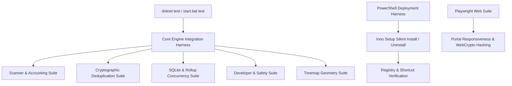

# ArborGraph Test Automation Feasibility & Tooling Matrix

**Document Identifier:** AG-AM-001  
**Target Release:** v1.0.0  
**Strategy Overview:** Maximize deterministic test automation for data calculations, filesystem parsing, database queries, and cryptographic deduplication while reserving manual validation for native Windows Explorer interop, installer deployment, and human usability.  

---

## 1. Automation Feasibility Matrix

| Test Case ID | Test Title / Functional Scope | Automatable? | Recommended Framework / Tool | Rationale | Priority |
| :--- | :--- | :--- | :--- | :--- | :--- |
| **`TC-DRV-01`** | Multi-Drive ClearIndex Data Scoping | **Yes** | .NET xUnit / Console Harness (`tests/`) | High-priority safety test; can mount virtual VHD or loopback drives | **P0 / Blocker** |
| **`TC-DRV-02`** | Simultaneous Multi-Drive Root Scan | **Yes** | .NET xUnit / Console Harness | Fast headless execution validating parallel channel writes | **P0 / Blocker** |
| **`TC-DEL-01`** | Windows Recycle Bin Safe Move | **Partial** | Win32 PowerShell / P/Invoke Harness | Deletion is automated; Recycle Bin recovery verification requires shell API | **P0 / Blocker** |
| **`TC-DEL-02`** | System Protected Path Refusal | **Yes** | .NET xUnit Unit Test | Pure logical validation of `FileActionService.IsProtectedPath` | **P0 / Blocker** |
| **`TC-DEL-03`** | Permanent Deletion Confirmation | **Partial** | UI Test (FlaUI / Appium Windows) | Requires mocking or automating modal confirmation dialog | **P1 / Critical** |
| **`TC-DEL-04`** | Read-Only Flag Reset Deletion | **Yes** | .NET Custom Harness | Generates read-only dummy file and verifies clean unlinking | **P2 / Major** |
| **`TC-UI-RESP-01`** | UI Thread Starvation on Mass Delete | **Yes** | WPF Dispatcher Latency Monitor | Measures dispatcher pump delay during simulated folder deletion | **P0 / Blocker** |
| **`TC-UI-RESP-02`** | UI Responsiveness on Large File Move | **Yes** | Stopwatch & Task Profiler | Quantifies synchronous blocking duration on large file deletion | **P1 / Critical** |
| **`TC-USN-01`** | Baseline USN Checkpoint Creation | **Yes** | .NET Console Integration Test | Elevated test runner queries SQLite `usn_checkpoints` table | **P1 / Critical** |
| **`TC-USN-02`** | USN Non-Elevated Standard Fallback | **Yes** | Headless Standard User Process | Launches test worker with standard tokens; asserts fallback log | **P0 / Blocker** |
| **`TC-USN-03`** | Non-NTFS (exFAT) Journal Bypass | **Yes** | Virtual Disk Harness (exFAT VHD) | Mounts exFAT volume; verifies `IsNtfsVolume` returns false | **P1 / Critical** |
| **`TC-USN-04`** | Mismatched Journal ID Fallback | **Yes** | SQLite Injected State Test | Injects bad JournalId; asserts fallback scan mode | **P1 / Critical** |
| **`TC-SCN-01`** | Bounded Channel Traversal & Accounting | **Yes** | .NET Integration Harness | Validates mathematical equality of visited/processed/skipped counters | **P1 / Critical** |
| **`TC-SCN-02`** | Scanner Safe Cancellation Lifecycle | **Yes** | Task Token Cancellation Harness | Verifies `CancellationTokenSource.Cancel()` commits cleanly | **P1 / Critical** |
| **`TC-SCN-03`** | Circular Junction Loop Avoidance | **Yes** | `mklink /J` Setup Script | Creates circular junction and asserts traversal terminates | **P1 / Critical** |
| **`TC-SCN-04`** | Cloud Placeholder Skip (OneDrive) | **Yes** | Win32 Attribute Setter Harness | Sets `RecallOnDataAccess` attribute and verifies file length skip | **P1 / Critical** |
| **`TC-SCN-05`** | Live Feed 40ms Throttling Buffer | **Yes** | Dispatcher Frame Counter | Asserts update frequency does not exceed 25 emissions/sec | **P2 / Major** |
| **`TC-ROL-01`** | Exact Recursive Folder Rollup | **Yes** | SQLite Query Assert Harness | Compares recursive directory sizes with reference ground truth | **P1 / Critical** |
| **`TC-ROL-02`** | 100K Folders Rollup LOH Memory Scalability | **Yes** | Memory Profiler Benchmark | Quantifies peak managed memory and execution latency | **P1 / Critical** |
| **`TC-DUP-01`** | 3-Stage Zero False Positive Detection | **Yes** | Synthetic Collision Pair Harness | Asserts same-size random files are rejected by MD5/SHA-256 | **P1 / Critical** |
| **`TC-DUP-02`** | Exact Duplicate Content Grouping | **Yes** | Controlled Hashing Test | Verifies true duplicate files are grouped with matching hash | **P1 / Critical** |
| **`TC-DUP-03`** | Duplicate Elimination Strategy Rules | **Yes** | Unit Test on `DuplicateViewModel` | Validates that strategy preserves keeper and selects copies | **P1 / Critical** |
| **`TC-DEV-01`** | Contextual Developer Storage Discovery | **Yes** | Synthetic Workspace Tree Harness | Asserts project marker validation prevents false positives | **P1 / Critical** |
| **`TC-SAF-01`** | Locked-File Safe Deletion Fallback | **Yes** | Exclusive File Handle Harness | Holds `FileShare.None` on file; asserts graceful bypass | **P0 / Blocker** |
| **`TC-TMP-01`** | Squarified Treemap Geometry Tiling | **Yes** | Headless Geometric Harness | Evaluates non-overlapping layout and canvas boundary constraints | **P1 / Critical** |
| **`TC-TMP-02`** | Zero-Size File Handling in Treemap | **Yes** | Geometric Unit Test | Asserts zero-size items do not produce NaN or Infinity | **P2 / Major** |
| **`TC-TMP-03`** | Canvas 0x0 Dimension Boundary | **Yes** | Geometric Unit Test | Validates that 0x0 or negative canvas sizes return cleanly | **P2 / Major** |
| **`TC-DB-01`** | SQLite Concurrent Read During Ingestion | **Yes** | Multi-threaded Task Harness | Stress tests simultaneous background writing and foreground querying | **P1 / Critical** |
| **`TC-DB-02`** | SQLite PRAGMA Integrity Check | **Yes** | SQLite Database Assertion | Executes integrity pragma and verifies "ok" scalar return | **P1 / Critical** |
| **`TC-PERF-01`** | 100K Files Ingestion Benchmark | **Yes** | Timed StopWatch Harness | Measures files/sec throughput and average/peak resource usage | **P1 / Critical** |
| **`TC-LGL-01`** | First-Run EULA Gate & Process Exit | **Partial** | STA WPF Thread Execution | Tests dialog logic; process exit requires sub-process invocation | **P0 / Blocker** |
| **`TC-SET-01`** | Settings Path Exclusion Enforcement | **Yes** | Integration Test Harness | Asserts that excluded paths are skipped during scanning | **P1 / Critical** |
| **`TC-SHL-01`** | Shell Open File / Reveal in Explorer | **No (Manual)**| Manual Desktop Inspection | Spawns Windows Explorer windows and external viewer processes | **P1 / Critical** |
| **`TC-INS-01`** | Inno Setup Clean Installation | **Yes** | PowerShell Silent Install Runner | Executes installer with `/VERYSILENT` and verifies deployed files | **P0 / Blocker** |
| **`TC-INS-04`** | Installer Registry & URL Drift Check | **Yes** | PowerShell Registry Inspector | Reads `Uninstall\ArborGraph` registry key to verify URL and publisher | **P0 / Blocker** |
| **`TC-WEB-01`** | Web Portal Simulation & Links | **Yes** | Playwright (Node.js / Chromium) | Automated browser test checking canvas simulation and download links | **P2 / Major** |
| **`TC-USA-01`** | Human Usability Task Evaluation | **No (Manual)**| Human Observer Protocol | Measures cognitive friction, confusion points, and real user feedback | **P1 / Critical** |

---

## 2. Recommended Automated Testing Architecture

1. **Core .NET Test Harness (`tests/DiskScope.Tests.csproj`):**
   - High-speed headless C# test runner executing all numerical, database, cryptographic, and geometric assertions.
   - Run command: `.\start.bat test` or `dotnet run --project tests/DiskScope.Tests.csproj`.
2. **Windows Shell & Deployment Runner (`scripts/test-installer.ps1`):**
   - Automated PowerShell script to compile installer using Inno Setup `iscc.exe`, execute silent installations, inspect registry keys for metadata accuracy, and verify clean uninstallation.
3. **Web Portal End-to-End Suite (`site/tests/`):**
   - Playwright headless browser script navigating `site/index.html`, verifying canvas sparklines, testing the interactive diagnostic simulation, and verifying that download links resolve properly.
